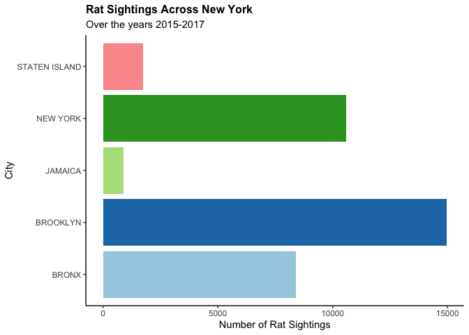
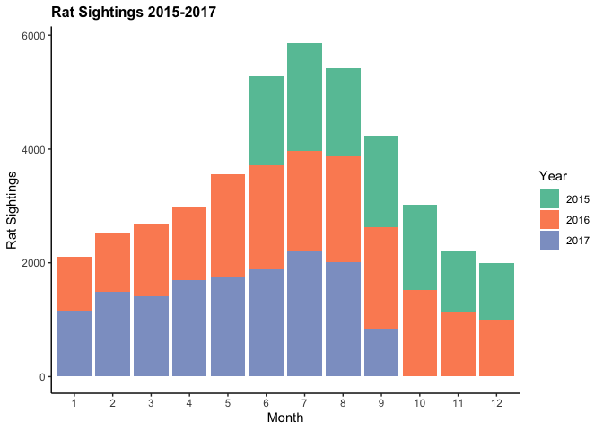
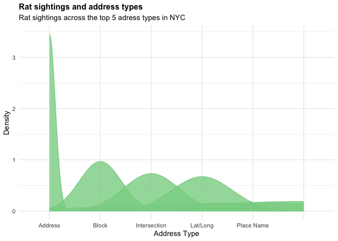

# Data Visualization Project 01 - New York City Rats

## Analysis

### Load packages


```r
library(tidyverse)
```

```
## ── Attaching packages ─────────────────────────────────────── tidyverse 1.3.2 ──
## ✔ ggplot2 3.4.0      ✔ purrr   1.0.1 
## ✔ tibble  3.1.8      ✔ dplyr   1.0.10
## ✔ tidyr   1.2.1      ✔ stringr 1.5.0 
## ✔ readr   2.1.3      ✔ forcats 0.5.2 
## ── Conflicts ────────────────────────────────────────── tidyverse_conflicts() ──
## ✖ dplyr::filter() masks stats::filter()
## ✖ dplyr::lag()    masks stats::lag()
```

```r
library(RColorBrewer)
```


### Import Data


```r
rats_data <- read.csv("~/Desktop/Summer A 2023/Data Viz/Projects/Final_Project/Ely_dataviz_final_project/data/rats_nyc.csv")
```


### Summarize each variable


```r
summary(rats_data)
```

```
##    unique_key       created_date       closed_date           agency         
##  Min.   :11464394   Length:41845       Length:41845       Length:41845      
##  1st Qu.:32373244   Class :character   Class :character   Class :character  
##  Median :34078758   Mode  :character   Mode  :character   Mode  :character  
##  Mean   :34056270                                                           
##  3rd Qu.:35825120                                                           
##  Max.   :37197000                                                           
##                                                                             
##  agency_name        complaint_type      descriptor        location_type     
##  Length:41845       Length:41845       Length:41845       Length:41845      
##  Class :character   Class :character   Class :character   Class :character  
##  Mode  :character   Mode  :character   Mode  :character   Mode  :character  
##                                                                             
##                                                                             
##                                                                             
##                                                                             
##   incident_zip   incident_address   street_name        cross_street_1    
##  Min.   :   83   Length:41845       Length:41845       Length:41845      
##  1st Qu.:10128   Class :character   Class :character   Class :character  
##  Median :11101   Mode  :character   Mode  :character   Mode  :character  
##  Mean   :10743                                                           
##  3rd Qu.:11223                                                           
##  Max.   :11694                                                           
##  NA's   :110                                                             
##  cross_street_2     intersection_street_1 intersection_street_2
##  Length:41845       Length:41845          Length:41845         
##  Class :character   Class :character      Class :character     
##  Mode  :character   Mode  :character      Mode  :character     
##                                                                
##                                                                
##                                                                
##                                                                
##  address_type           city             landmark         facility_type 
##  Length:41845       Length:41845       Length:41845       Mode:logical  
##  Class :character   Class :character   Class :character   NA's:41845    
##  Mode  :character   Mode  :character   Mode  :character                 
##                                                                         
##                                                                         
##                                                                         
##                                                                         
##     status            due_date         resolution_action_updated_date
##  Length:41845       Length:41845       Length:41845                  
##  Class :character   Class :character   Class :character              
##  Mode  :character   Mode  :character   Mode  :character              
##                                                                      
##                                                                      
##                                                                      
##                                                                      
##  community_board      borough          x_coordinate_state_plane
##  Length:41845       Length:41845       Min.   : 914381         
##  Class :character   Class :character   1st Qu.: 993971         
##  Mode  :character   Mode  :character   Median :1001120         
##                                        Mean   :1002619         
##                                        3rd Qu.:1011667         
##                                        Max.   :1066634         
##                                        NA's   :319             
##  y_coordinate_state_plane park_facility_name park_borough      
##  Min.   :121361           Length:41845       Length:41845      
##  1st Qu.:186878           Class :character   Class :character  
##  Median :202934           Mode  :character   Mode  :character  
##  Mean   :208690                                                
##  3rd Qu.:235860                                                
##  Max.   :271861                                                
##  NA's   :319                                                   
##  school_name        school_number      school_region      school_code       
##  Length:41845       Length:41845       Length:41845       Length:41845      
##  Class :character   Class :character   Class :character   Class :character  
##  Mode  :character   Mode  :character   Mode  :character   Mode  :character  
##                                                                             
##                                                                             
##                                                                             
##                                                                             
##  school_phone_number school_address     school_city        school_state      
##  Length:41845        Length:41845       Length:41845       Length:41845      
##  Class :character    Class :character   Class :character   Class :character  
##  Mode  :character    Mode  :character   Mode  :character   Mode  :character  
##                                                                              
##                                                                              
##                                                                              
##                                                                              
##   school_zip        school_not_found   school_or_citywide_complaint
##  Length:41845       Length:41845       Mode:logical                
##  Class :character   Class :character   NA's:41845                  
##  Mode  :character   Mode  :character                               
##                                                                    
##                                                                    
##                                                                    
##                                                                    
##  vehicle_type   taxi_company_borough taxi_pick_up_location bridge_highway_name
##  Mode:logical   Mode:logical         Mode:logical          Mode:logical       
##  NA's:41845     NA's:41845           NA's:41845            NA's:41845         
##                                                                               
##                                                                               
##                                                                               
##                                                                               
##                                                                               
##  bridge_highway_direction road_ramp      bridge_highway_segment garage_lot_name
##  Mode:logical             Mode:logical   Mode:logical           Mode:logical   
##  NA's:41845               NA's:41845     NA's:41845             NA's:41845     
##                                                                                
##                                                                                
##                                                                                
##                                                                                
##                                                                                
##  ferry_direction ferry_terminal_name    latitude       longitude     
##  Mode:logical    Mode:logical        Min.   :40.50   Min.   :-74.25  
##  NA's:41845      NA's:41845          1st Qu.:40.68   1st Qu.:-73.97  
##                                      Median :40.72   Median :-73.94  
##                                      Mean   :40.74   Mean   :-73.93  
##                                      3rd Qu.:40.81   3rd Qu.:-73.90  
##                                      Max.   :40.91   Max.   :-73.70  
##                                      NA's   :319     NA's   :319     
##    location         sighting_year  sighting_month   sighting_day  
##  Length:41845       Min.   :2015   Min.   : 1.00   Min.   : 1.00  
##  Class :character   1st Qu.:2016   1st Qu.: 5.00   1st Qu.: 8.00  
##  Mode  :character   Median :2016   Median : 7.00   Median :15.00  
##                     Mean   :2016   Mean   : 6.63   Mean   :15.53  
##                     3rd Qu.:2017   3rd Qu.: 9.00   3rd Qu.:23.00  
##                     Max.   :2017   Max.   :12.00   Max.   :31.00  
##                                                                   
##  sighting_weekday  
##  Length:41845      
##  Class :character  
##  Mode  :character  
##                    
##                    
##                    
## 
```


### Summary Statistics


##### Rat sightings based on cities


```r
city_rats <- table(toupper(rats_data$city))
city_rats
```

```
## 
##             ARVERNE             ASTORIA             BAYSIDE             BEDSTUY 
##                  22                 453                 147                   1 
##           BELLEROSE               BRONX            BROOKLYN            BROOKYLN 
##                  28                8401               14964                   1 
##          BROOKYN NY     CAMBRIA HEIGHTS        CENTRAL PARK       COLLEGE POINT 
##                   1                  37                  15                  29 
##              CORONA       EAST ELMHURST            ELMHURST        FAR ROCKAWAY 
##                 223                 127                 214                  98 
##         FLORAL PARK            FLUSHING        FOREST HILLS       FORREST HILLS 
##                  10                 277                  69                   1 
##       FRESH MEADOWS           GLEN OAKS              HOLLIS        HOWARD BEACH 
##                  47                  10                  54                  76 
##     JACKSON HEIGHTS             JAMAICA         KEW GARDENS         LITTLE NECK 
##                 245                 890                  27                  20 
##    LONG ISLAND CITY           MANHATTAN             MASPETH      MIDDLE VILLAGE 
##                 218                   2                 144                 131 
##       NEW HYDE PARK            NEW YORK     OAKLAND GARDENS          OZONE PARK 
##                   1               10600                  24                 222 
##              QUEENS      QUEENS VILLAGE           REGO PARK       RICHMOND HILL 
##                   3                 118                 156                 126 
##           RIDGEWOOD       ROCKAWAY PARK            ROSEDALE        SAINT ALBANS 
##                 580                  26                  38                 164 
##    SOUTH OZONE PARK SOUTH RICHMOND HILL SPRINGFIELD GARDENS       STATEN ISLAND 
##                 127                 119                  83                1752 
##           SUNNYSIDE          WHITESTONE           WOODHAVEN            WOODSIDE 
##                  62                 123                  77                 345
```


> When running this line - I noticed due to the case sensitivity the city variable included duplicate city names with different case, so I used the *toupper()* function to remove the duplicates.


```r
rats_data$city <- toupper(rats_data$city)
```


## Visualizations


### Visualization 1: Largest Number of Rat Sightings in New York


> To get a general feel of the data, I started by looking at the frequency of rat sightings across the most frequent cities. 


```r
rats_data %>% 
  group_by(city) %>% 
  summarise(count=n()) %>% 
  top_n(5, wt=count) %>% 
  ggplot(aes(x=city, y=count, fill=city)) +
  scale_fill_brewer(palette="Paired") +
  geom_col() +
  labs(title="Rat Sightings Across New York", subtitle="Over the years 2015-2017", x="City", y="Number of Rat Sightings") +
  theme_classic() +
  coord_flip() +
  theme(legend.position="none") +
  theme(plot.title=element_text(face="bold", size=12)) 
```

<!-- -->

- Brooklyn and New York City have the highest frequency of rat sightings, with over 10,000 each over the years 2015-2017. Bronx follows, and Staten Island and Jamaica have much lower numbers. All of these areas are cities/boroughs in or near New York City, so it seems the majority of the rat population comes from NYC and it's adjacent cities. This visualization is limited, as a basic bar graph. 

- Originally, the graph was vertical. However realizing that the x-axis was cateogrical, I found horizontal bars to be a better visualization. It's easier to process amounts when the bars are horizontal.


### Visualization 2: Number of Rat Sightings Over Time


> For this visualization, I wanted to look at the rat sightings over spans of time. Using geographical context, we can assume the general season of these times.


```r
rats_data %>% group_by(sighting_year, sighting_month) %>% 
  summarise(count=n()) %>% 
  ggplot(aes(x=as.factor(sighting_month), y=count, fill=as.factor(sighting_year))) +
  scale_fill_brewer(palette="Set2") +
  geom_col() +
  labs(title="Rat Sightings 2015-2017", x="Month",y="Rat Sightings", fill="Year") +
  theme_classic() +
  theme(plot.title=element_text(face="bold", size=12)) 
```

```
## `summarise()` has grouped output by 'sighting_year'. You can override using the
## `.groups` argument.
```

<!-- -->


- It can be seen that the summer season (June-September) has the highest numbers of rat sightings. The frigid weather during the colder seasons of New York may cause the rats to seek and stay in shelter, however it could also present mass death. More data would be needed to further explore this idea.

- Some months had no sightings in specific years. 2015 specifically lacked sightings across months the most, from Janaury to May. 2017 had a similar pattern in October-December. This could possibly be due to rat control measures, or from data collection.

- I used a palette with distinct colors to visualize the different years. I originally used co-ord flip, but due to the axes being nominal, a vertical bar graph is more useful in describing the data. By using stacked bars, it allows us to see not only the variation of month, but also year. Looking at multiple variables at once better explains the correlation, however too many variables can clutter and make the graph confusing, which is why I wanted to keep it fairly simple.


### Visualization 3: Rat Sightings & Address Type


```r
rats_data2 <- rats_data %>%
  arrange(desc(location_type)) %>% 
  group_by(location_type) %>% 
  top_n(4, location_type)
head(rats_data2)
```

```
## # A tibble: 6 × 56
## # Groups:   location_type [1]
##   uniqu…¹ creat…² close…³ agency agenc…⁴ compl…⁵ descr…⁶ locat…⁷ incid…⁸ incid…⁹
##     <int> <chr>   <chr>   <chr>  <chr>   <chr>   <chr>   <chr>     <int> <chr>  
## 1  3.15e7 2015-0… 09/10/… DOHMH  Depart… Rodent  Rat Si… Vacant…   10453 <NA>   
## 2  3.15e7 2015-0… 09/22/… DOHMH  Depart… Rodent  Rat Si… Vacant…   10461 1863 L…
## 3  3.15e7 2015-0… <NA>    DOHMH  Depart… Rodent  Rat Si… Vacant…   11207 <NA>   
## 4  3.15e7 2015-0… 08/12/… DOHMH  Depart… Rodent  Rat Si… Vacant…   11201 84 BER…
## 5  3.15e7 2015-0… 10/01/… DOHMH  Depart… Rodent  Rat Si… Vacant…   10013 557 BR…
## 6  3.15e7 2015-0… 09/16/… DOHMH  Depart… Rodent  Rat Si… Vacant…   10459 <NA>   
## # … with 46 more variables: street_name <chr>, cross_street_1 <chr>,
## #   cross_street_2 <chr>, intersection_street_1 <chr>,
## #   intersection_street_2 <chr>, address_type <chr>, city <chr>,
## #   landmark <chr>, facility_type <lgl>, status <chr>, due_date <chr>,
## #   resolution_action_updated_date <chr>, community_board <chr>, borough <chr>,
## #   x_coordinate_state_plane <int>, y_coordinate_state_plane <int>,
## #   park_facility_name <chr>, park_borough <chr>, school_name <chr>, …
```

> I wanted to look at this chart to change up from the bar charts and see if there's anything to learn from this visualization. Address type can explain the distribution of rat sightings per location. With this, we can visualize the different categories used to classify whether the sighting was reported from an address, block, intersection, latitude and longitude, or the name of a specific place. 


```r
rats_data2 %>% 
  group_by(address_type) %>% 
  ggplot(aes(x=address_type, na.rm=T)) +
  geom_density(fill="#89D293", color="#89D293", alpha=0.8, na.rm=T)+
  theme_minimal() +
  scale_x_discrete(labels = c('Address','Block','Intersection', 'Lat/Long', 'Place Name', '')) +
  labs(title="Rat sightings and address types", x="Address Type", y="Density", subtitle="Rat sightings across the top 5 adress types in NYC") +
  theme(plot.title=element_text(face="bold", size=12)) 
```

<!-- -->

- Looking at this density distribution, it can be seen that most of the rat sightings, besides those at residential addresses, occur outdoors on blocks and intersections. I would have expected those to be at places like restaurants and stores (i.e. "Place Name"), as those are areas with food and other waste, but the visualization shows otherwise. Address seems like the easiest location to verify rat sightings and utilize proper control measures.

- I chose this graph as it's one that's not seen often, looking back, a bar graph would've been more useful, but after creating 2 other bar graphs, I wanted to change things up.

