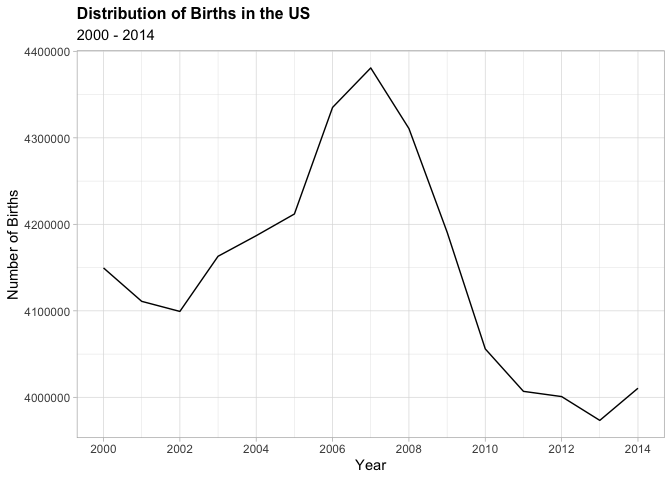
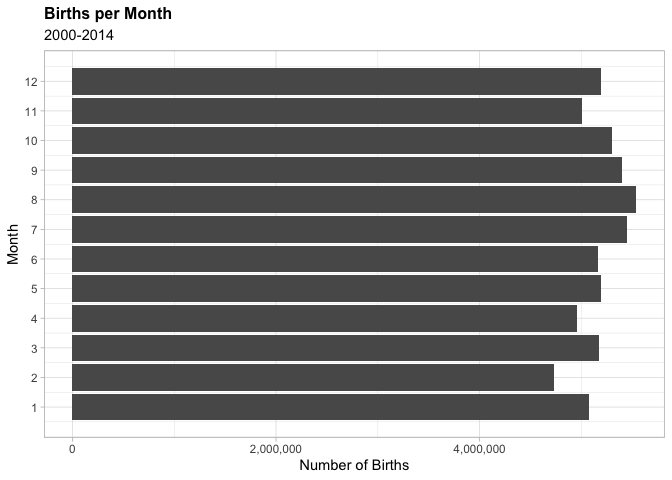
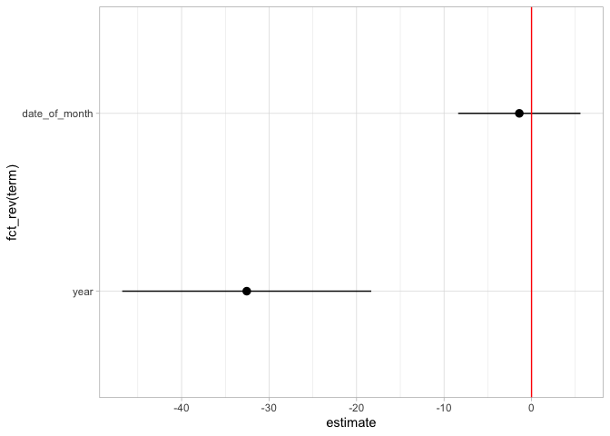
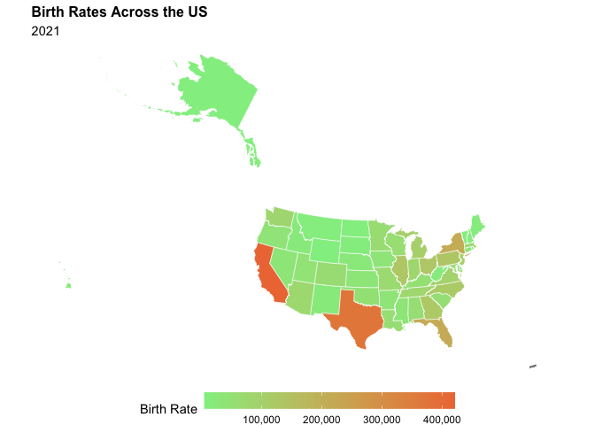

# Data Visualization Project 02: US Birth Rates (2000-2014)


My motivation for this project is to explore birth rates across the US states from 2000-2014. Birth rates are a defining factor in population and general welfare across the US. It's interesting to see the fluctuation in rates across years, as well as across states. We can infer aspects such as the economy, the existing populations in states, as well as the comparison between child-bearing age citizens vs. non-childbearing ages in certain states.


```r
library(tidyverse)
```

```
## ── Attaching packages ─────────────────────────────────────── tidyverse 1.3.2 ──
## ✔ ggplot2 3.4.0      ✔ purrr   1.0.1 
## ✔ tibble  3.1.8      ✔ dplyr   1.0.10
## ✔ tidyr   1.2.1      ✔ stringr 1.5.0 
## ✔ readr   2.1.3      ✔ forcats 0.5.2 
## ── Conflicts ────────────────────────────────────────── tidyverse_conflicts() ──
## ✖ dplyr::filter() masks stats::filter()
## ✖ dplyr::lag()    masks stats::lag()
```

```r
library(plotly)
```

```
## 
## Attaching package: 'plotly'
## 
## The following object is masked from 'package:ggplot2':
## 
##     last_plot
## 
## The following object is masked from 'package:stats':
## 
##     filter
## 
## The following object is masked from 'package:graphics':
## 
##     layout
```

```r
library(dplyr)
library(broom)
library(sf)
```

```
## Linking to GEOS 3.11.0, GDAL 3.5.3, PROJ 9.1.0; sf_use_s2() is TRUE
```

```r
library(RColorBrewer)
library(scales)
```

```
## 
## Attaching package: 'scales'
## 
## The following object is masked from 'package:purrr':
## 
##     discard
## 
## The following object is masked from 'package:readr':
## 
##     col_factor
```


```r
us_births <- read_csv("~/Desktop/Summer A 2023/Data Viz/Projects/Ely_dataviz_mini-project_02/data/us_births_00_14.csv")
```

```
## Rows: 5479 Columns: 6
## ── Column specification ────────────────────────────────────────────────────────
## Delimiter: ","
## chr  (1): day_of_week
## dbl  (4): year, month, date_of_month, births
## date (1): date
## 
## ℹ Use `spec()` to retrieve the full column specification for this data.
## ℹ Specify the column types or set `show_col_types = FALSE` to quiet this message.
```

```r
spatial_births <- read_csv("~/Desktop/Summer A 2023/Data Viz/Projects/Ely_dataviz_mini-project_02/data/birth-rate-by-state.csv")
```

```
## Rows: 50 Columns: 4
## ── Column specification ────────────────────────────────────────────────────────
## Delimiter: ","
## chr (1): state
## dbl (3): birthsPer1K, cdc2021Births, cbWomenWhoGaveBirth2021
## 
## ℹ Use `spec()` to retrieve the full column specification for this data.
## ℹ Specify the column types or set `show_col_types = FALSE` to quiet this message.
```

## Summarizing the data


```r
head(us_births)
```

```
## # A tibble: 6 × 6
##    year month date_of_month date       day_of_week births
##   <dbl> <dbl>         <dbl> <date>     <chr>        <dbl>
## 1  2000     1             1 2000-01-01 Sat           9083
## 2  2000     1             2 2000-01-02 Sun           8006
## 3  2000     1             3 2000-01-03 Mon          11363
## 4  2000     1             4 2000-01-04 Tues         13032
## 5  2000     1             5 2000-01-05 Wed          12558
## 6  2000     1             6 2000-01-06 Thurs        12466
```


```r
births_by_year <- us_births %>%
  group_by(year) %>%
  summarize(total_births=sum(births))
```


```r
births_by_year %>% 
  ggplot(aes(x=year, y=total_births)) + 
  geom_line() +
  labs(title="Distribution of Births in the US",
       subtitle="2000 - 2014",
       x="Year",
       y="Number of Births") +
  theme_light() +
  theme(plot.title=element_text(face="bold", size=12)) +
  scale_x_continuous(breaks=seq(2000, 2014, by=2))
```

<!-- -->
- I wanted to get a better understanding of the data by doing a few simpler visualizations. I started by plotting the number of birthdays per year on a line. This allowed me to see a spike in births in 2007, and a steep decline in 2009-2013. There are a few possibilities for this, such as the 2008 recession. 


```r
births_month <- us_births %>%
  group_by(month) %>%
  summarize(count=sum(births))
```


```r
births_month %>% 
  ggplot(aes(x=month, y = count)) +
  geom_bar(stat="identity") +
  labs(x="Month", 
       y="Number of Births", 
       title="Births per Month", 
       subtitle="2000-2014") +
  coord_flip() +
  scale_x_continuous(breaks=seq(1, 12, by=1)) +
  theme_light() +
  theme(plot.title=element_text(face="bold", size=12)) +
  scale_fill_viridis_c(name="Area", labels = scales::comma) +
  scale_y_continuous(labels = comma)
```

<!-- -->


- Another I wanted to look at were the months with the most births, which didn't yield very much. The month with the most births is August, whereas the least is February. This is no surprise, months with more days, unlike February, have more births. 

- Originally, the number of births were in scientific notation, which bothered me as it becomes more difficult to understand. With the spatial visualization homework, I learned how to use scales and applied it here.

## Visualization 1: Interactive Visualization


```r
births_month_year <- us_births %>%
  group_by(year, month) %>%
  summarize(count=sum(births))
```

```
## `summarise()` has grouped output by 'year'. You can override using the
## `.groups` argument.
```


```r
viz1 <- births_month_year %>% 
  ggplot(aes(x=month, y=count, color=as.factor(year))) +
  geom_line() +
  labs(x="Month", 
       y="Number of Births", 
       title="Birth Counts by Month and Year", 
       color="Year") +
  theme_light() +
  scale_x_continuous(breaks=seq(1, 12, by=1)) +
  theme(plot.title=element_text(face="bold", size=12))
```


```r
interactive_plot <- ggplotly(viz1) 
interactive_plot
```

```{=html}
<div class="plotly html-widget html-fill-item-overflow-hidden html-fill-item" id="htmlwidget-80c1125981a294709553" style="width:672px;height:480px;"></div>
<script type="application/json" data-for="htmlwidget-80c1125981a294709553">{"x":{"data":[{"x":[1,2,3,4,5,6,7,8,9,10,11,12],"y":[337739,324046,347824,323357,347950,347899,356131,367893,355981,352368,342494,345916],"text":["month:  1<br />count: 337739<br />as.factor(year): 2000","month:  2<br />count: 324046<br />as.factor(year): 2000","month:  3<br />count: 347824<br />as.factor(year): 2000","month:  4<br />count: 323357<br />as.factor(year): 2000","month:  5<br />count: 347950<br />as.factor(year): 2000","month:  6<br />count: 347899<br />as.factor(year): 2000","month:  7<br />count: 356131<br />as.factor(year): 2000","month:  8<br />count: 367893<br />as.factor(year): 2000","month:  9<br />count: 355981<br />as.factor(year): 2000","month: 10<br />count: 352368<br />as.factor(year): 2000","month: 11<br />count: 342494<br />as.factor(year): 2000","month: 12<br />count: 345916<br />as.factor(year): 2000"],"type":"scatter","mode":"lines","line":{"width":1.88976377952756,"color":"rgba(248,118,109,1)","dash":"solid"},"hoveron":"points","name":"2000","legendgroup":"2000","showlegend":true,"xaxis":"x","yaxis":"y","hoverinfo":"text","frame":null},{"x":[1,2,3,4,5,6,7,8,9,10,11,12],"y":[342379,309819,345345,329884,350689,337606,358079,369383,349988,351852,331276,334663],"text":["month:  1<br />count: 342379<br />as.factor(year): 2001","month:  2<br />count: 309819<br />as.factor(year): 2001","month:  3<br />count: 345345<br />as.factor(year): 2001","month:  4<br />count: 329884<br />as.factor(year): 2001","month:  5<br />count: 350689<br />as.factor(year): 2001","month:  6<br />count: 337606<br />as.factor(year): 2001","month:  7<br />count: 358079<br />as.factor(year): 2001","month:  8<br />count: 369383<br />as.factor(year): 2001","month:  9<br />count: 349988<br />as.factor(year): 2001","month: 10<br />count: 351852<br />as.factor(year): 2001","month: 11<br />count: 331276<br />as.factor(year): 2001","month: 12<br />count: 334663<br />as.factor(year): 2001"],"type":"scatter","mode":"lines","line":{"width":1.88976377952756,"color":"rgba(229,135,0,1)","dash":"solid"},"hoveron":"points","name":"2001","legendgroup":"2001","showlegend":true,"xaxis":"x","yaxis":"y","hoverinfo":"text","frame":null},{"x":[1,2,3,4,5,6,7,8,9,10,11,12],"y":[337472,309910,337349,330289,344851,333432,363960,366409,355701,352738,325379,341823],"text":["month:  1<br />count: 337472<br />as.factor(year): 2002","month:  2<br />count: 309910<br />as.factor(year): 2002","month:  3<br />count: 337349<br />as.factor(year): 2002","month:  4<br />count: 330289<br />as.factor(year): 2002","month:  5<br />count: 344851<br />as.factor(year): 2002","month:  6<br />count: 333432<br />as.factor(year): 2002","month:  7<br />count: 363960<br />as.factor(year): 2002","month:  8<br />count: 366409<br />as.factor(year): 2002","month:  9<br />count: 355701<br />as.factor(year): 2002","month: 10<br />count: 352738<br />as.factor(year): 2002","month: 11<br />count: 325379<br />as.factor(year): 2002","month: 12<br />count: 341823<br />as.factor(year): 2002"],"type":"scatter","mode":"lines","line":{"width":1.88976377952756,"color":"rgba(201,152,0,1)","dash":"solid"},"hoveron":"points","name":"2002","legendgroup":"2002","showlegend":true,"xaxis":"x","yaxis":"y","hoverinfo":"text","frame":null},{"x":[1,2,3,4,5,6,7,8,9,10,11,12],"y":[336163,312789,342574,335691,352315,342884,370236,366421,366321,360634,326388,350644],"text":["month:  1<br />count: 336163<br />as.factor(year): 2003","month:  2<br />count: 312789<br />as.factor(year): 2003","month:  3<br />count: 342574<br />as.factor(year): 2003","month:  4<br />count: 335691<br />as.factor(year): 2003","month:  5<br />count: 352315<br />as.factor(year): 2003","month:  6<br />count: 342884<br />as.factor(year): 2003","month:  7<br />count: 370236<br />as.factor(year): 2003","month:  8<br />count: 366421<br />as.factor(year): 2003","month:  9<br />count: 366321<br />as.factor(year): 2003","month: 10<br />count: 360634<br />as.factor(year): 2003","month: 11<br />count: 326388<br />as.factor(year): 2003","month: 12<br />count: 350644<br />as.factor(year): 2003"],"type":"scatter","mode":"lines","line":{"width":1.88976377952756,"color":"rgba(163,165,0,1)","dash":"solid"},"hoveron":"points","name":"2003","legendgroup":"2003","showlegend":true,"xaxis":"x","yaxis":"y","hoverinfo":"text","frame":null},{"x":[1,2,3,4,5,6,7,8,9,10,11,12],"y":[339077,321348,352379,339079,343248,350876,365380,361835,362895,355048,342359,353339],"text":["month:  1<br />count: 339077<br />as.factor(year): 2004","month:  2<br />count: 321348<br />as.factor(year): 2004","month:  3<br />count: 352379<br />as.factor(year): 2004","month:  4<br />count: 339079<br />as.factor(year): 2004","month:  5<br />count: 343248<br />as.factor(year): 2004","month:  6<br />count: 350876<br />as.factor(year): 2004","month:  7<br />count: 365380<br />as.factor(year): 2004","month:  8<br />count: 361835<br />as.factor(year): 2004","month:  9<br />count: 362895<br />as.factor(year): 2004","month: 10<br />count: 355048<br />as.factor(year): 2004","month: 11<br />count: 342359<br />as.factor(year): 2004","month: 12<br />count: 353339<br />as.factor(year): 2004"],"type":"scatter","mode":"lines","line":{"width":1.88976377952756,"color":"rgba(107,177,0,1)","dash":"solid"},"hoveron":"points","name":"2004","legendgroup":"2004","showlegend":true,"xaxis":"x","yaxis":"y","hoverinfo":"text","frame":null},{"x":[1,2,3,4,5,6,7,8,9,10,11,12],"y":[337478,314890,355121,338060,351736,356576,363196,376467,370354,351161,342182,354720],"text":["month:  1<br />count: 337478<br />as.factor(year): 2005","month:  2<br />count: 314890<br />as.factor(year): 2005","month:  3<br />count: 355121<br />as.factor(year): 2005","month:  4<br />count: 338060<br />as.factor(year): 2005","month:  5<br />count: 351736<br />as.factor(year): 2005","month:  6<br />count: 356576<br />as.factor(year): 2005","month:  7<br />count: 363196<br />as.factor(year): 2005","month:  8<br />count: 376467<br />as.factor(year): 2005","month:  9<br />count: 370354<br />as.factor(year): 2005","month: 10<br />count: 351161<br />as.factor(year): 2005","month: 11<br />count: 342182<br />as.factor(year): 2005","month: 12<br />count: 354720<br />as.factor(year): 2005"],"type":"scatter","mode":"lines","line":{"width":1.88976377952756,"color":"rgba(0,186,56,1)","dash":"solid"},"hoveron":"points","name":"2005","legendgroup":"2005","showlegend":true,"xaxis":"x","yaxis":"y","hoverinfo":"text","frame":null},{"x":[1,2,3,4,5,6,7,8,9,10,11,12],"y":[345976,324435,362520,334587,360901,363615,373445,394199,381204,373685,357976,362611],"text":["month:  1<br />count: 345976<br />as.factor(year): 2006","month:  2<br />count: 324435<br />as.factor(year): 2006","month:  3<br />count: 362520<br />as.factor(year): 2006","month:  4<br />count: 334587<br />as.factor(year): 2006","month:  5<br />count: 360901<br />as.factor(year): 2006","month:  6<br />count: 363615<br />as.factor(year): 2006","month:  7<br />count: 373445<br />as.factor(year): 2006","month:  8<br />count: 394199<br />as.factor(year): 2006","month:  9<br />count: 381204<br />as.factor(year): 2006","month: 10<br />count: 373685<br />as.factor(year): 2006","month: 11<br />count: 357976<br />as.factor(year): 2006","month: 12<br />count: 362611<br />as.factor(year): 2006"],"type":"scatter","mode":"lines","line":{"width":1.88976377952756,"color":"rgba(0,191,125,1)","dash":"solid"},"hoveron":"points","name":"2006","legendgroup":"2006","showlegend":true,"xaxis":"x","yaxis":"y","hoverinfo":"text","frame":null},{"x":[1,2,3,4,5,6,7,8,9,10,11,12],"y":[360521,331617,365888,342981,367491,363486,384861,396355,372774,375272,359335,360203],"text":["month:  1<br />count: 360521<br />as.factor(year): 2007","month:  2<br />count: 331617<br />as.factor(year): 2007","month:  3<br />count: 365888<br />as.factor(year): 2007","month:  4<br />count: 342981<br />as.factor(year): 2007","month:  5<br />count: 367491<br />as.factor(year): 2007","month:  6<br />count: 363486<br />as.factor(year): 2007","month:  7<br />count: 384861<br />as.factor(year): 2007","month:  8<br />count: 396355<br />as.factor(year): 2007","month:  9<br />count: 372774<br />as.factor(year): 2007","month: 10<br />count: 375272<br />as.factor(year): 2007","month: 11<br />count: 359335<br />as.factor(year): 2007","month: 12<br />count: 360203<br />as.factor(year): 2007"],"type":"scatter","mode":"lines","line":{"width":1.88976377952756,"color":"rgba(0,192,175,1)","dash":"solid"},"hoveron":"points","name":"2007","legendgroup":"2007","showlegend":true,"xaxis":"x","yaxis":"y","hoverinfo":"text","frame":null},{"x":[1,2,3,4,5,6,7,8,9,10,11,12],"y":[361868,343354,355484,351344,359835,353430,380707,379046,373625,363420,328905,359719],"text":["month:  1<br />count: 361868<br />as.factor(year): 2008","month:  2<br />count: 343354<br />as.factor(year): 2008","month:  3<br />count: 355484<br />as.factor(year): 2008","month:  4<br />count: 351344<br />as.factor(year): 2008","month:  5<br />count: 359835<br />as.factor(year): 2008","month:  6<br />count: 353430<br />as.factor(year): 2008","month:  7<br />count: 380707<br />as.factor(year): 2008","month:  8<br />count: 379046<br />as.factor(year): 2008","month:  9<br />count: 373625<br />as.factor(year): 2008","month: 10<br />count: 363420<br />as.factor(year): 2008","month: 11<br />count: 328905<br />as.factor(year): 2008","month: 12<br />count: 359719<br />as.factor(year): 2008"],"type":"scatter","mode":"lines","line":{"width":1.88976377952756,"color":"rgba(0,188,216,1)","dash":"solid"},"hoveron":"points","name":"2008","legendgroup":"2008","showlegend":true,"xaxis":"x","yaxis":"y","hoverinfo":"text","frame":null},{"x":[1,2,3,4,5,6,7,8,9,10,11,12],"y":[342975,321122,352571,341822,349831,351620,373491,364795,367694,353059,325247,346764],"text":["month:  1<br />count: 342975<br />as.factor(year): 2009","month:  2<br />count: 321122<br />as.factor(year): 2009","month:  3<br />count: 352571<br />as.factor(year): 2009","month:  4<br />count: 341822<br />as.factor(year): 2009","month:  5<br />count: 349831<br />as.factor(year): 2009","month:  6<br />count: 351620<br />as.factor(year): 2009","month:  7<br />count: 373491<br />as.factor(year): 2009","month:  8<br />count: 364795<br />as.factor(year): 2009","month:  9<br />count: 367694<br />as.factor(year): 2009","month: 10<br />count: 353059<br />as.factor(year): 2009","month: 11<br />count: 325247<br />as.factor(year): 2009","month: 12<br />count: 346764<br />as.factor(year): 2009"],"type":"scatter","mode":"lines","line":{"width":1.88976377952756,"color":"rgba(0,176,246,1)","dash":"solid"},"hoveron":"points","name":"2009","legendgroup":"2009","showlegend":true,"xaxis":"x","yaxis":"y","hoverinfo":"text","frame":null},{"x":[1,2,3,4,5,6,7,8,9,10,11,12],"y":[328120,306393,343448,329137,332651,338966,349648,354727,355887,341767,330984,344247],"text":["month:  1<br />count: 328120<br />as.factor(year): 2010","month:  2<br />count: 306393<br />as.factor(year): 2010","month:  3<br />count: 343448<br />as.factor(year): 2010","month:  4<br />count: 329137<br />as.factor(year): 2010","month:  5<br />count: 332651<br />as.factor(year): 2010","month:  6<br />count: 338966<br />as.factor(year): 2010","month:  7<br />count: 349648<br />as.factor(year): 2010","month:  8<br />count: 354727<br />as.factor(year): 2010","month:  9<br />count: 355887<br />as.factor(year): 2010","month: 10<br />count: 341767<br />as.factor(year): 2010","month: 11<br />count: 330984<br />as.factor(year): 2010","month: 12<br />count: 344247<br />as.factor(year): 2010"],"type":"scatter","mode":"lines","line":{"width":1.88976377952756,"color":"rgba(97,156,255,1)","dash":"solid"},"hoveron":"points","name":"2010","legendgroup":"2010","showlegend":true,"xaxis":"x","yaxis":"y","hoverinfo":"text","frame":null},{"x":[1,2,3,4,5,6,7,8,9,10,11,12],"y":[324845,301927,334439,317225,330667,341637,349841,364194,350662,333132,326107,332232],"text":["month:  1<br />count: 324845<br />as.factor(year): 2011","month:  2<br />count: 301927<br />as.factor(year): 2011","month:  3<br />count: 334439<br />as.factor(year): 2011","month:  4<br />count: 317225<br />as.factor(year): 2011","month:  5<br />count: 330667<br />as.factor(year): 2011","month:  6<br />count: 341637<br />as.factor(year): 2011","month:  7<br />count: 349841<br />as.factor(year): 2011","month:  8<br />count: 364194<br />as.factor(year): 2011","month:  9<br />count: 350662<br />as.factor(year): 2011","month: 10<br />count: 333132<br />as.factor(year): 2011","month: 11<br />count: 326107<br />as.factor(year): 2011","month: 12<br />count: 332232<br />as.factor(year): 2011"],"type":"scatter","mode":"lines","line":{"width":1.88976377952756,"color":"rgba(185,131,255,1)","dash":"solid"},"hoveron":"points","name":"2011","legendgroup":"2011","showlegend":true,"xaxis":"x","yaxis":"y","hoverinfo":"text","frame":null},{"x":[1,2,3,4,5,6,7,8,9,10,11,12],"y":[320661,308262,328123,310118,333908,330785,351472,365501,344333,349973,329306,328426],"text":["month:  1<br />count: 320661<br />as.factor(year): 2012","month:  2<br />count: 308262<br />as.factor(year): 2012","month:  3<br />count: 328123<br />as.factor(year): 2012","month:  4<br />count: 310118<br />as.factor(year): 2012","month:  5<br />count: 333908<br />as.factor(year): 2012","month:  6<br />count: 330785<br />as.factor(year): 2012","month:  7<br />count: 351472<br />as.factor(year): 2012","month:  8<br />count: 365501<br />as.factor(year): 2012","month:  9<br />count: 344333<br />as.factor(year): 2012","month: 10<br />count: 349973<br />as.factor(year): 2012","month: 11<br />count: 329306<br />as.factor(year): 2012","month: 12<br />count: 328426<br />as.factor(year): 2012"],"type":"scatter","mode":"lines","line":{"width":1.88976377952756,"color":"rgba(231,107,243,1)","dash":"solid"},"hoveron":"points","name":"2012","legendgroup":"2012","showlegend":true,"xaxis":"x","yaxis":"y","hoverinfo":"text","frame":null},{"x":[1,2,3,4,5,6,7,8,9,10,11,12],"y":[327352,294882,323629,314847,332868,322868,352495,356879,341676,344285,322157,339399],"text":["month:  1<br />count: 327352<br />as.factor(year): 2013","month:  2<br />count: 294882<br />as.factor(year): 2013","month:  3<br />count: 323629<br />as.factor(year): 2013","month:  4<br />count: 314847<br />as.factor(year): 2013","month:  5<br />count: 332868<br />as.factor(year): 2013","month:  6<br />count: 322868<br />as.factor(year): 2013","month:  7<br />count: 352495<br />as.factor(year): 2013","month:  8<br />count: 356879<br />as.factor(year): 2013","month:  9<br />count: 341676<br />as.factor(year): 2013","month: 10<br />count: 344285<br />as.factor(year): 2013","month: 11<br />count: 322157<br />as.factor(year): 2013","month: 12<br />count: 339399<br />as.factor(year): 2013"],"type":"scatter","mode":"lines","line":{"width":1.88976377952756,"color":"rgba(253,97,209,1)","dash":"solid"},"hoveron":"points","name":"2013","legendgroup":"2013","showlegend":true,"xaxis":"x","yaxis":"y","hoverinfo":"text","frame":null},{"x":[1,2,3,4,5,6,7,8,9,10,11,12],"y":[329962,300899,326267,322329,336504,327680,357476,356066,350497,344471,318655,339726],"text":["month:  1<br />count: 329962<br />as.factor(year): 2014","month:  2<br />count: 300899<br />as.factor(year): 2014","month:  3<br />count: 326267<br />as.factor(year): 2014","month:  4<br />count: 322329<br />as.factor(year): 2014","month:  5<br />count: 336504<br />as.factor(year): 2014","month:  6<br />count: 327680<br />as.factor(year): 2014","month:  7<br />count: 357476<br />as.factor(year): 2014","month:  8<br />count: 356066<br />as.factor(year): 2014","month:  9<br />count: 350497<br />as.factor(year): 2014","month: 10<br />count: 344471<br />as.factor(year): 2014","month: 11<br />count: 318655<br />as.factor(year): 2014","month: 12<br />count: 339726<br />as.factor(year): 2014"],"type":"scatter","mode":"lines","line":{"width":1.88976377952756,"color":"rgba(255,103,164,1)","dash":"solid"},"hoveron":"points","name":"2014","legendgroup":"2014","showlegend":true,"xaxis":"x","yaxis":"y","hoverinfo":"text","frame":null}],"layout":{"margin":{"t":42.1685346616853,"r":7.30593607305936,"b":40.1826484018265,"l":60.6392694063927},"plot_bgcolor":"rgba(255,255,255,1)","paper_bgcolor":"rgba(255,255,255,1)","font":{"color":"rgba(0,0,0,1)","family":"","size":14.6118721461187},"title":{"text":"<b> Birth Counts by Month and Year <\/b>","font":{"color":"rgba(0,0,0,1)","family":"","size":15.9402241594022},"x":0,"xref":"paper"},"xaxis":{"domain":[0,1],"automargin":true,"type":"linear","autorange":false,"range":[0.45,12.55],"tickmode":"array","ticktext":["1","2","3","4","5","6","7","8","9","10","11","12"],"tickvals":[1,2,3,4,5,6,7,8,9,10,11,12],"categoryorder":"array","categoryarray":["1","2","3","4","5","6","7","8","9","10","11","12"],"nticks":null,"ticks":"outside","tickcolor":"rgba(179,179,179,1)","ticklen":3.65296803652968,"tickwidth":0.33208800332088,"showticklabels":true,"tickfont":{"color":"rgba(77,77,77,1)","family":"","size":11.689497716895},"tickangle":-0,"showline":false,"linecolor":null,"linewidth":0,"showgrid":true,"gridcolor":"rgba(222,222,222,1)","gridwidth":0.33208800332088,"zeroline":false,"anchor":"y","title":{"text":"Month","font":{"color":"rgba(0,0,0,1)","family":"","size":14.6118721461187}},"hoverformat":".2f"},"yaxis":{"domain":[0,1],"automargin":true,"type":"linear","autorange":false,"range":[289808.35,401428.65],"tickmode":"array","ticktext":["300000","325000","350000","375000","400000"],"tickvals":[300000,325000,350000,375000,400000],"categoryorder":"array","categoryarray":["300000","325000","350000","375000","400000"],"nticks":null,"ticks":"outside","tickcolor":"rgba(179,179,179,1)","ticklen":3.65296803652968,"tickwidth":0.33208800332088,"showticklabels":true,"tickfont":{"color":"rgba(77,77,77,1)","family":"","size":11.689497716895},"tickangle":-0,"showline":false,"linecolor":null,"linewidth":0,"showgrid":true,"gridcolor":"rgba(222,222,222,1)","gridwidth":0.33208800332088,"zeroline":false,"anchor":"x","title":{"text":"Number of Births","font":{"color":"rgba(0,0,0,1)","family":"","size":14.6118721461187}},"hoverformat":".2f"},"shapes":[{"type":"rect","fillcolor":"transparent","line":{"color":"rgba(179,179,179,1)","width":0.66417600664176,"linetype":"solid"},"yref":"paper","xref":"paper","x0":0,"x1":1,"y0":0,"y1":1}],"showlegend":true,"legend":{"bgcolor":"rgba(255,255,255,1)","bordercolor":"transparent","borderwidth":1.88976377952756,"font":{"color":"rgba(0,0,0,1)","family":"","size":11.689497716895},"title":{"text":"Year","font":{"color":"rgba(0,0,0,1)","family":"","size":14.6118721461187}}},"hovermode":"closest","barmode":"relative"},"config":{"doubleClick":"reset","modeBarButtonsToAdd":["hoverclosest","hovercompare"],"showSendToCloud":false},"source":"A","attrs":{"ae093737bad7":{"x":{},"y":{},"colour":{},"type":"scatter"}},"cur_data":"ae093737bad7","visdat":{"ae093737bad7":["function (y) ","x"]},"highlight":{"on":"plotly_click","persistent":false,"dynamic":false,"selectize":false,"opacityDim":0.2,"selected":{"opacity":1},"debounce":0},"shinyEvents":["plotly_hover","plotly_click","plotly_selected","plotly_relayout","plotly_brushed","plotly_brushing","plotly_clickannotation","plotly_doubleclick","plotly_deselect","plotly_afterplot","plotly_sunburstclick"],"base_url":"https://plot.ly"},"evals":[],"jsHooks":[]}</script>
```


```r
htmlwidgets::saveWidget(interactive_plot, "birth_month_year.html")
```

- For the interactive visualization, I figured a line chart would be best, as it allows you to see each data point across the line. I found the 2009-2013 dip interesting, so I wanted to see what that would look like with the addition of months. Adding months to the graph definitely changed things, whereas the month bar graph showed very little variation. This has less to do with the data, and more to do with the fact that the contents of a visualization can starkly change the perception. In the original month bar-graph, the y-axis ranged from 200k-400k, whereas this visualization only spans from 300k-400k, which makes the graph easier to digest.

## Visualization 2: Model Visualization 


```r
birth_model <- lm(births ~ year + date_of_month, data=us_births)
tidy(birth_model)
```

```
## # A tibble: 3 × 5
##   term          estimate std.error statistic     p.value
##   <chr>            <dbl>     <dbl>     <dbl>       <dbl>
## 1 (Intercept)   76707.    14571.       5.26  0.000000146
## 2 year            -32.6       7.26    -4.48  0.00000748 
## 3 date_of_month    -1.40      3.56    -0.392 0.695
```

```r
birth_coefs <- tidy(birth_model, conf.int=TRUE) %>% 
  filter(term!="(Intercept)")
birth_coefs
```

```
## # A tibble: 2 × 7
##   term          estimate std.error statistic    p.value conf.low conf.high
##   <chr>            <dbl>     <dbl>     <dbl>      <dbl>    <dbl>     <dbl>
## 1 year            -32.6       7.26    -4.48  0.00000748   -46.8     -18.3 
## 2 date_of_month    -1.40      3.56    -0.392 0.695         -8.39      5.59
```


```r
birth_coefs %>% 
ggplot(aes(x=estimate, y=fct_rev(term))) +
  geom_pointrange(aes(xmin=conf.low, xmax=conf.high)) +
  geom_vline(xintercept=0, color="red") + 
  theme_light()
```

<!-- -->
- In this plot, it's show that year has a far negative impact on birth numbers, and date of month teeters between positive and negative at 0, which means it has very little impact.


## Visualization 3: Spatial Visualization

This was when I realized the US Births data would be difficult to use for the next plot, as it lacked geographical data. 

> I found data for state birth rates in 2021 from [World Population Review](https://worldpopulationreview.com/state-rankings/birth-rate-by-state) to continue with this visualization. I also downloaded a shape file from census.gov.


```r
library(sf)
states <- read_sf("~/Desktop/Summer A 2023/Data Viz/Projects/Ely_dataviz_mini-project_02/data/cb_2018_us_state_20m/cb_2018_us_state_20m.shp")
```


```r
birth_rates <- spatial_births %>%
  select(state, cdc2021Births) %>% 
  rename(births=cdc2021Births) %>% 
  rename(NAME=state)
```

> To merge the shapefile and the data, I had to select and rename the variables to match up.
 

```r
state_data <- left_join(states, birth_rates, by="NAME")
map_limits <- st_crs("+proj=aea +lat_1=29.5 +lat_2=45.5 +lat_0=37.5 +lon_0=-96")
```


```r
state_data %>% ggplot() +
  geom_sf(aes(fill=births), color="white") +
  coord_sf(crs=map_limits) +
  scale_fill_gradient(low="lightgreen", high="sienna2", name="Birth Rate", labels=scales::comma) +
  theme_void() +
  theme(legend.position="bottom", 
        legend.key.size=unit(1, 'cm'),
        legend.key.height=unit(0.5, 'cm'),
        legend.key.width=unit(1.5, 'cm'),
        plot.title=element_text(face="bold", size=12)) +
  labs(title="Birth Rates Across the US", subtitle="2021") +
  scale_y_continuous(labels=comma) 
```

<!-- -->

- This visualization shows the birth rates across the US in 2021. We can see California and Texas have large spikes in birth rates, probably due to their already high population numbers.
