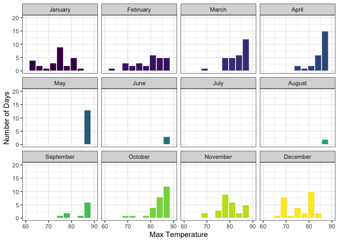
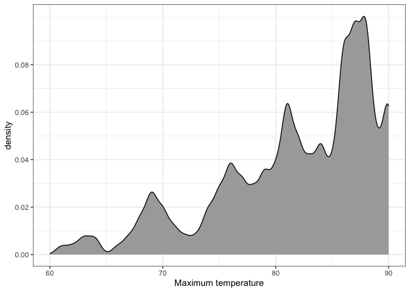
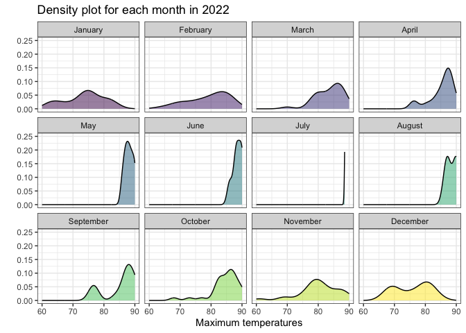
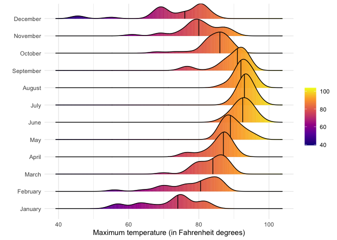
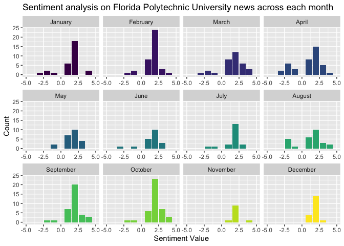

# Data Visualization Project 03


## PART 1: Density Plots

Using the dataset obtained from FSU's [Florida Climate Center](https://climatecenter.fsu.edu/climate-data-access-tools/downloadable-data), for a station at Tampa International Airport (TPA) for 2022, attempt to recreate the charts shown below which were generated using data from 2016. You can read the 2022 dataset using the code below: 


```r
library(tidyverse)
weather_tpa <- read_csv("https://raw.githubusercontent.com/reisanar/datasets/master/tpa_weather_2022.csv")
# random sample 
sample_n(weather_tpa, 4)
```

```
## # A tibble: 4 × 7
##    year month   day precipitation max_temp min_temp ave_temp
##   <dbl> <dbl> <dbl>         <dbl>    <dbl>    <dbl>    <dbl>
## 1  2022     1    28       0.00001       67       54     60.5
## 2  2022     9    24       0             92       76     84  
## 3  2022     5    29       0             92       72     82  
## 4  2022     5    17       0             89       75     82
```

```r
summary(weather_tpa)
```

```
##       year          month             day        precipitation   
##  Min.   :2022   Min.   : 1.000   Min.   : 1.00   Min.   :0.0000  
##  1st Qu.:2022   1st Qu.: 4.000   1st Qu.: 8.00   1st Qu.:0.0000  
##  Median :2022   Median : 7.000   Median :16.00   Median :0.0000  
##  Mean   :2022   Mean   : 6.526   Mean   :15.72   Mean   :0.1697  
##  3rd Qu.:2022   3rd Qu.:10.000   3rd Qu.:23.00   3rd Qu.:0.0300  
##  Max.   :2022   Max.   :12.000   Max.   :31.00   Max.   :2.8600  
##     max_temp        min_temp        ave_temp    
##  Min.   :45.00   Min.   :31.00   Min.   :38.00  
##  1st Qu.:80.00   1st Qu.:63.00   1st Qu.:71.00  
##  Median :87.00   Median :70.00   Median :78.00  
##  Mean   :84.54   Mean   :68.21   Mean   :76.37  
##  3rd Qu.:92.00   3rd Qu.:77.00   3rd Qu.:84.00  
##  Max.   :98.00   Max.   :83.00   Max.   :89.50
```

See https://www.reisanar.com/slides/relationships-models#10 for a reminder on how to use this type of dataset with the `lubridate` package for dates and times (example included in the slides uses data from 2016).

Using the 2022 data: 

(a) Create a plot like the one below:


Hint: the option `binwidth = 3` was used with the `geom_histogram()` function.


### A


```r
library(ggplot2)
library(RColorBrewer)
library(lubridate)
```

```
## Loading required package: timechange
```

```
## 
## Attaching package: 'lubridate'
```

```
## The following objects are masked from 'package:base':
## 
##     date, intersect, setdiff, union
```

```r
library(tidyverse)
weather_tpa <- read_csv("https://raw.githubusercontent.com/reisanar/datasets/master/tpa_weather_2022.csv")
```

```
## Rows: 365 Columns: 7
## ── Column specification ────────────────────────────────────────────────────────
## Delimiter: ","
## dbl (7): year, month, day, precipitation, max_temp, min_temp, ave_temp
## 
## ℹ Use `spec()` to retrieve the full column specification for this data.
## ℹ Specify the column types or set `show_col_types = FALSE` to quiet this message.
```

```r
sample_n(weather_tpa, 4)
```

```
## # A tibble: 4 × 7
##    year month   day precipitation max_temp min_temp ave_temp
##   <dbl> <dbl> <dbl>         <dbl>    <dbl>    <dbl>    <dbl>
## 1  2022     1    14             0       72       55     63.5
## 2  2022     9    29             0       77       65     71  
## 3  2022    11     7             0       87       70     78.5
## 4  2022    12    25             0       46       31     38.5
```

```r
tpa_clean <- weather_tpa %>% 
  unite("doy", year, month, day, sep="-") %>% 
  mutate(date=ymd(doy), 
         max_temp=as.double(max_temp), 
         min_temp=as.double(min_temp))
```


```r
tpa_months <- tpa_clean %>% 
  mutate(month_num=month(date), 
    month_abb=month(date, label=TRUE), 
    month_name=month(date, label=TRUE, abbr=FALSE))
```


```r
tpa_months %>% 
  ggplot(aes(x=max_temp, na.rm=T)) +
  geom_histogram(aes(fill = month_name, position = "dodge"), binwidth=3, color="white") +
  scale_fill_viridis_d() +
  labs(x = "Max Temperature", y = "Number of Days") +
  facet_wrap(~ month_name, ncol = 4) +
  xlim(c(60, 90)) +
  ylim(c(0,20)) +
  theme_bw() +
  theme(legend.position="") 
```

```
## Warning in geom_histogram(aes(fill = month_name, position = "dodge"), binwidth =
## 3, : Ignoring unknown aesthetics: position
```

```
## Warning: Removed 116 rows containing non-finite values (`stat_bin()`).
```

```
## Warning: Removed 24 rows containing missing values (`geom_bar()`).
```

<!-- -->


(b) Create a plot like the one below:


### B


```r
tpa_clean %>% 
  ggplot(aes(x=max_temp)) +
  geom_density(bw=0.5, fill="darkgray") +
  xlim(c(60,90)) +
  scale_y_continuous(breaks=seq(0, 0.08, by=0.02)) +
  scale_fill_manual(name="Area") +
  labs(x="Maximum temperature") +
  theme_bw()
```

```
## Warning: Removed 116 rows containing non-finite values (`stat_density()`).
```

<!-- -->


Hint: check the `kernel` parameter of the `geom_density()` function, and use `bw = 0.5`.

(c) Create a plot like the one below:


Hint: default options for `geom_density()` were used. 

### C


```r
tpa_months %>% 
  ggplot(aes(x=max_temp, na.rm=T)) +
  geom_density(aes(fill=month_name, position="dodge"), binwidth=3, color="black", alpha=0.5) +
  scale_fill_viridis_d() +
  labs(title="Density plot for each month in 2022", x="Maximum temperatures", y="") +
  facet_wrap(~ month_name, ncol=4) +
  xlim(c(60, 90)) +
  ylim(c(0,0.25)) +
  theme_bw() +
  theme(legend.position="") 
```

```
## Warning in geom_density(aes(fill = month_name, position = "dodge"), binwidth =
## 3, : Ignoring unknown parameters: `binwidth`
```

```
## Warning in geom_density(aes(fill = month_name, position = "dodge"), binwidth =
## 3, : Ignoring unknown aesthetics: position
```

```
## Warning: Removed 116 rows containing non-finite values (`stat_density()`).
```

<!-- -->


(d) Generate a plot like the chart below:


Hint: use the`{ggridges}` package, and the `geom_density_ridges()` function paying close attention to the `quantile_lines` and `quantiles` parameters. The plot above uses the `plasma` option (color scale) for the _viridis_ palette.

### D


```r
library(ggridges)
```


```r
tpa_months %>% 
  ggplot(aes(x=max_temp, y=month_name, fill=stat(x))) +
  stat_density_ridges(geom = "density_ridges_gradient", calc_ecdf = TRUE,
                      quantiles = 2, quantile_lines = TRUE) +
  labs(x="Maximum temperature (in Fahrenheit degrees)", y="") +
  scale_fill_viridis_c(name = "", option = "C") +
  theme_minimal()
```

```
## Warning: `stat(x)` was deprecated in ggplot2 3.4.0.
## ℹ Please use `after_stat(x)` instead.
```

```
## Picking joint bandwidth of 1.93
```

```
## Warning: Using the `size` aesthietic with geom_segment was deprecated in ggplot2 3.4.0.
## ℹ Please use the `linewidth` aesthetic instead.
```

<!-- -->


(e) Create a plot of your choice that uses the attribute for precipitation _(values of -99.9 for temperature or -99.99 for precipitation represent missing data)_.

### E

```r
library(plotly)
```

```
## 
## Attaching package: 'plotly'
```

```
## The following object is masked from 'package:ggplot2':
## 
##     last_plot
```

```
## The following object is masked from 'package:stats':
## 
##     filter
```

```
## The following object is masked from 'package:graphics':
## 
##     layout
```


```r
int_plot <- tpa_months %>% 
  ggplot(aes(x=max_temp, y=precipitation, color=month_name)) +
  geom_point() +
  labs(x="Maximum temperature", y="Precipitation", title="Precipitation vs. maximum temperature", subtitle="Tampa International Airport - 2022", color="") +
  theme_bw()
interactive_plot <- ggplotly(int_plot)
```


```r
interactive_plot
```

```{=html}
<div class="plotly html-widget html-fill-item-overflow-hidden html-fill-item" id="htmlwidget-f19cddfaaad397b303f6" style="width:672px;height:480px;"></div>
<script type="application/json" data-for="htmlwidget-f19cddfaaad397b303f6">{"x":{"data":[{"x":[82,82,75,76,75,74,81,81,84,81,73,77,74,72,75,71,66,64,75,78,76,62,57,63,57,63,74,67,55,58,69],"y":[0,0,0.02,0,0,1e-05,1e-05,0,0,0,0,0,0,0,0,0.68,0,0,0,0,0,0.01,1e-05,0,0.67,0.08,0,1e-05,0,0,0],"text":["max_temp: 82<br />precipitation: 0.00000<br />month_name: January","max_temp: 82<br />precipitation: 0.00000<br />month_name: January","max_temp: 75<br />precipitation: 0.02000<br />month_name: January","max_temp: 76<br />precipitation: 0.00000<br />month_name: January","max_temp: 75<br />precipitation: 0.00000<br />month_name: January","max_temp: 74<br />precipitation: 0.00001<br />month_name: January","max_temp: 81<br />precipitation: 0.00001<br />month_name: January","max_temp: 81<br />precipitation: 0.00000<br />month_name: January","max_temp: 84<br />precipitation: 0.00000<br />month_name: January","max_temp: 81<br />precipitation: 0.00000<br />month_name: January","max_temp: 73<br />precipitation: 0.00000<br />month_name: January","max_temp: 77<br />precipitation: 0.00000<br />month_name: January","max_temp: 74<br />precipitation: 0.00000<br />month_name: January","max_temp: 72<br />precipitation: 0.00000<br />month_name: January","max_temp: 75<br />precipitation: 0.00000<br />month_name: January","max_temp: 71<br />precipitation: 0.68000<br />month_name: January","max_temp: 66<br />precipitation: 0.00000<br />month_name: January","max_temp: 64<br />precipitation: 0.00000<br />month_name: January","max_temp: 75<br />precipitation: 0.00000<br />month_name: January","max_temp: 78<br />precipitation: 0.00000<br />month_name: January","max_temp: 76<br />precipitation: 0.00000<br />month_name: January","max_temp: 62<br />precipitation: 0.01000<br />month_name: January","max_temp: 57<br />precipitation: 0.00001<br />month_name: January","max_temp: 63<br />precipitation: 0.00000<br />month_name: January","max_temp: 57<br />precipitation: 0.67000<br />month_name: January","max_temp: 63<br />precipitation: 0.08000<br />month_name: January","max_temp: 74<br />precipitation: 0.00000<br />month_name: January","max_temp: 67<br />precipitation: 0.00001<br />month_name: January","max_temp: 55<br />precipitation: 0.00000<br />month_name: January","max_temp: 58<br />precipitation: 0.00000<br />month_name: January","max_temp: 69<br />precipitation: 0.00000<br />month_name: January"],"type":"scatter","mode":"markers","marker":{"autocolorscale":false,"color":"rgba(68,1,84,1)","opacity":1,"size":5.66929133858268,"symbol":"circle","line":{"width":1.88976377952756,"color":"rgba(68,1,84,1)"}},"hoveron":"points","name":"January","legendgroup":"January","showlegend":true,"xaxis":"x","yaxis":"y","hoverinfo":"text","frame":null},{"x":[76,82,85,83,71,64,70,56,69,72,78,80,76,68,75,84,86,81,77,82,86,87,86,86,84,85,82,80],"y":[0,0,0,0,0.02,0.02,0,0.35,1e-05,0,0,1e-05,0.1,0,0,0,0,0,0.13,0,0,0,0,0,0,0,0,0],"text":["max_temp: 76<br />precipitation: 0.00000<br />month_name: February","max_temp: 82<br />precipitation: 0.00000<br />month_name: February","max_temp: 85<br />precipitation: 0.00000<br />month_name: February","max_temp: 83<br />precipitation: 0.00000<br />month_name: February","max_temp: 71<br />precipitation: 0.02000<br />month_name: February","max_temp: 64<br />precipitation: 0.02000<br />month_name: February","max_temp: 70<br />precipitation: 0.00000<br />month_name: February","max_temp: 56<br />precipitation: 0.35000<br />month_name: February","max_temp: 69<br />precipitation: 0.00001<br />month_name: February","max_temp: 72<br />precipitation: 0.00000<br />month_name: February","max_temp: 78<br />precipitation: 0.00000<br />month_name: February","max_temp: 80<br />precipitation: 0.00001<br />month_name: February","max_temp: 76<br />precipitation: 0.10000<br />month_name: February","max_temp: 68<br />precipitation: 0.00000<br />month_name: February","max_temp: 75<br />precipitation: 0.00000<br />month_name: February","max_temp: 84<br />precipitation: 0.00000<br />month_name: February","max_temp: 86<br />precipitation: 0.00000<br />month_name: February","max_temp: 81<br />precipitation: 0.00000<br />month_name: February","max_temp: 77<br />precipitation: 0.13000<br />month_name: February","max_temp: 82<br />precipitation: 0.00000<br />month_name: February","max_temp: 86<br />precipitation: 0.00000<br />month_name: February","max_temp: 87<br />precipitation: 0.00000<br />month_name: February","max_temp: 86<br />precipitation: 0.00000<br />month_name: February","max_temp: 86<br />precipitation: 0.00000<br />month_name: February","max_temp: 84<br />precipitation: 0.00000<br />month_name: February","max_temp: 85<br />precipitation: 0.00000<br />month_name: February","max_temp: 82<br />precipitation: 0.00000<br />month_name: February","max_temp: 80<br />precipitation: 0.00000<br />month_name: February"],"type":"scatter","mode":"markers","marker":{"autocolorscale":false,"color":"rgba(72,33,115,1)","opacity":1,"size":5.66929133858268,"symbol":"circle","line":{"width":1.88976377952756,"color":"rgba(72,33,115,1)"}},"hoveron":"points","name":"February","legendgroup":"February","showlegend":true,"xaxis":"x","yaxis":"y","hoverinfo":"text","frame":null},{"x":[79,78,83,89,88,89,88,86,86,84,86,79,70,81,84,80,79,87,86,84,85,88,87,77,80,81,81,83,86,88,86],"y":[0,0,0,0,0,0,0,0,0,1e-05,0,0.41,0,0,1.04,1e-05,0,0,0,0,0,0,0,1.42,0,0,0,0,0,0,0.04],"text":["max_temp: 79<br />precipitation: 0.00000<br />month_name: March","max_temp: 78<br />precipitation: 0.00000<br />month_name: March","max_temp: 83<br />precipitation: 0.00000<br />month_name: March","max_temp: 89<br />precipitation: 0.00000<br />month_name: March","max_temp: 88<br />precipitation: 0.00000<br />month_name: March","max_temp: 89<br />precipitation: 0.00000<br />month_name: March","max_temp: 88<br />precipitation: 0.00000<br />month_name: March","max_temp: 86<br />precipitation: 0.00000<br />month_name: March","max_temp: 86<br />precipitation: 0.00000<br />month_name: March","max_temp: 84<br />precipitation: 0.00001<br />month_name: March","max_temp: 86<br />precipitation: 0.00000<br />month_name: March","max_temp: 79<br />precipitation: 0.41000<br />month_name: March","max_temp: 70<br />precipitation: 0.00000<br />month_name: March","max_temp: 81<br />precipitation: 0.00000<br />month_name: March","max_temp: 84<br />precipitation: 1.04000<br />month_name: March","max_temp: 80<br />precipitation: 0.00001<br />month_name: March","max_temp: 79<br />precipitation: 0.00000<br />month_name: March","max_temp: 87<br />precipitation: 0.00000<br />month_name: March","max_temp: 86<br />precipitation: 0.00000<br />month_name: March","max_temp: 84<br />precipitation: 0.00000<br />month_name: March","max_temp: 85<br />precipitation: 0.00000<br />month_name: March","max_temp: 88<br />precipitation: 0.00000<br />month_name: March","max_temp: 87<br />precipitation: 0.00000<br />month_name: March","max_temp: 77<br />precipitation: 1.42000<br />month_name: March","max_temp: 80<br />precipitation: 0.00000<br />month_name: March","max_temp: 81<br />precipitation: 0.00000<br />month_name: March","max_temp: 81<br />precipitation: 0.00000<br />month_name: March","max_temp: 83<br />precipitation: 0.00000<br />month_name: March","max_temp: 86<br />precipitation: 0.00000<br />month_name: March","max_temp: 88<br />precipitation: 0.00000<br />month_name: March","max_temp: 86<br />precipitation: 0.04000<br />month_name: March"],"type":"scatter","mode":"markers","marker":{"autocolorscale":false,"color":"rgba(67,62,133,1)","opacity":1,"size":5.66929133858268,"symbol":"circle","line":{"width":1.88976377952756,"color":"rgba(67,62,133,1)"}},"hoveron":"points","name":"March","legendgroup":"March","showlegend":true,"xaxis":"x","yaxis":"y","hoverinfo":"text","frame":null},{"x":[83,83,80,85,88,87,81,76,76,77,85,88,86,86,87,88,88,91,84,85,87,87,88,90,90,87,88,88,89,87],"y":[1.37,1.11,0,0,0,0,1.34,0,0,0,0,0,0,0,0.02,0,0,0,0,0,0,0,0,0,0,0,0,0.14,1.22,1.56],"text":["max_temp: 83<br />precipitation: 1.37000<br />month_name: April","max_temp: 83<br />precipitation: 1.11000<br />month_name: April","max_temp: 80<br />precipitation: 0.00000<br />month_name: April","max_temp: 85<br />precipitation: 0.00000<br />month_name: April","max_temp: 88<br />precipitation: 0.00000<br />month_name: April","max_temp: 87<br />precipitation: 0.00000<br />month_name: April","max_temp: 81<br />precipitation: 1.34000<br />month_name: April","max_temp: 76<br />precipitation: 0.00000<br />month_name: April","max_temp: 76<br />precipitation: 0.00000<br />month_name: April","max_temp: 77<br />precipitation: 0.00000<br />month_name: April","max_temp: 85<br />precipitation: 0.00000<br />month_name: April","max_temp: 88<br />precipitation: 0.00000<br />month_name: April","max_temp: 86<br />precipitation: 0.00000<br />month_name: April","max_temp: 86<br />precipitation: 0.00000<br />month_name: April","max_temp: 87<br />precipitation: 0.02000<br />month_name: April","max_temp: 88<br />precipitation: 0.00000<br />month_name: April","max_temp: 88<br />precipitation: 0.00000<br />month_name: April","max_temp: 91<br />precipitation: 0.00000<br />month_name: April","max_temp: 84<br />precipitation: 0.00000<br />month_name: April","max_temp: 85<br />precipitation: 0.00000<br />month_name: April","max_temp: 87<br />precipitation: 0.00000<br />month_name: April","max_temp: 87<br />precipitation: 0.00000<br />month_name: April","max_temp: 88<br />precipitation: 0.00000<br />month_name: April","max_temp: 90<br />precipitation: 0.00000<br />month_name: April","max_temp: 90<br />precipitation: 0.00000<br />month_name: April","max_temp: 87<br />precipitation: 0.00000<br />month_name: April","max_temp: 88<br />precipitation: 0.00000<br />month_name: April","max_temp: 88<br />precipitation: 0.14000<br />month_name: April","max_temp: 89<br />precipitation: 1.22000<br />month_name: April","max_temp: 87<br />precipitation: 1.56000<br />month_name: April"],"type":"scatter","mode":"markers","marker":{"autocolorscale":false,"color":"rgba(56,89,140,1)","opacity":1,"size":5.66929133858268,"symbol":"circle","line":{"width":1.88976377952756,"color":"rgba(56,89,140,1)"}},"hoveron":"points","name":"April","legendgroup":"April","showlegend":true,"xaxis":"x","yaxis":"y","hoverinfo":"text","frame":null},{"x":[86,87,88,88,90,89,87,89,90,87,86,87,86,88,88,87,89,91,90,88,90,96,92,94,95,92,89,92,92,96,93],"y":[0.03,0,0.62,0,0,0,0.15,0,0,0,0,0,0,0,0,0,0,0,0,0.17,1e-05,0,1e-05,0.01,0,0,0,0,0,1.65,0.08],"text":["max_temp: 86<br />precipitation: 0.03000<br />month_name: May","max_temp: 87<br />precipitation: 0.00000<br />month_name: May","max_temp: 88<br />precipitation: 0.62000<br />month_name: May","max_temp: 88<br />precipitation: 0.00000<br />month_name: May","max_temp: 90<br />precipitation: 0.00000<br />month_name: May","max_temp: 89<br />precipitation: 0.00000<br />month_name: May","max_temp: 87<br />precipitation: 0.15000<br />month_name: May","max_temp: 89<br />precipitation: 0.00000<br />month_name: May","max_temp: 90<br />precipitation: 0.00000<br />month_name: May","max_temp: 87<br />precipitation: 0.00000<br />month_name: May","max_temp: 86<br />precipitation: 0.00000<br />month_name: May","max_temp: 87<br />precipitation: 0.00000<br />month_name: May","max_temp: 86<br />precipitation: 0.00000<br />month_name: May","max_temp: 88<br />precipitation: 0.00000<br />month_name: May","max_temp: 88<br />precipitation: 0.00000<br />month_name: May","max_temp: 87<br />precipitation: 0.00000<br />month_name: May","max_temp: 89<br />precipitation: 0.00000<br />month_name: May","max_temp: 91<br />precipitation: 0.00000<br />month_name: May","max_temp: 90<br />precipitation: 0.00000<br />month_name: May","max_temp: 88<br />precipitation: 0.17000<br />month_name: May","max_temp: 90<br />precipitation: 0.00001<br />month_name: May","max_temp: 96<br />precipitation: 0.00000<br />month_name: May","max_temp: 92<br />precipitation: 0.00001<br />month_name: May","max_temp: 94<br />precipitation: 0.01000<br />month_name: May","max_temp: 95<br />precipitation: 0.00000<br />month_name: May","max_temp: 92<br />precipitation: 0.00000<br />month_name: May","max_temp: 89<br />precipitation: 0.00000<br />month_name: May","max_temp: 92<br />precipitation: 0.00000<br />month_name: May","max_temp: 92<br />precipitation: 0.00000<br />month_name: May","max_temp: 96<br />precipitation: 1.65000<br />month_name: May","max_temp: 93<br />precipitation: 0.08000<br />month_name: May"],"type":"scatter","mode":"markers","marker":{"autocolorscale":false,"color":"rgba(45,112,142,1)","opacity":1,"size":5.66929133858268,"symbol":"circle","line":{"width":1.88976377952756,"color":"rgba(45,112,142,1)"}},"hoveron":"points","name":"May","legendgroup":"May","showlegend":true,"xaxis":"x","yaxis":"y","hoverinfo":"text","frame":null},{"x":[89,91,86,88,91,91,92,92,88,91,90,90,92,94,95,95,97,98,94,95,94,92,93,95,92,96,93,95,94,93],"y":[1e-05,1.6,1e-05,0.47,0,0,0.16,0,0.1,0.01,2.81,0,0,0,0.11,1e-05,0,0,0.04,0.1,0,0,0,0.19,0,0,1.28,0.09,0.04,1.07],"text":["max_temp: 89<br />precipitation: 0.00001<br />month_name: June","max_temp: 91<br />precipitation: 1.60000<br />month_name: June","max_temp: 86<br />precipitation: 0.00001<br />month_name: June","max_temp: 88<br />precipitation: 0.47000<br />month_name: June","max_temp: 91<br />precipitation: 0.00000<br />month_name: June","max_temp: 91<br />precipitation: 0.00000<br />month_name: June","max_temp: 92<br />precipitation: 0.16000<br />month_name: June","max_temp: 92<br />precipitation: 0.00000<br />month_name: June","max_temp: 88<br />precipitation: 0.10000<br />month_name: June","max_temp: 91<br />precipitation: 0.01000<br />month_name: June","max_temp: 90<br />precipitation: 2.81000<br />month_name: June","max_temp: 90<br />precipitation: 0.00000<br />month_name: June","max_temp: 92<br />precipitation: 0.00000<br />month_name: June","max_temp: 94<br />precipitation: 0.00000<br />month_name: June","max_temp: 95<br />precipitation: 0.11000<br />month_name: June","max_temp: 95<br />precipitation: 0.00001<br />month_name: June","max_temp: 97<br />precipitation: 0.00000<br />month_name: June","max_temp: 98<br />precipitation: 0.00000<br />month_name: June","max_temp: 94<br />precipitation: 0.04000<br />month_name: June","max_temp: 95<br />precipitation: 0.10000<br />month_name: June","max_temp: 94<br />precipitation: 0.00000<br />month_name: June","max_temp: 92<br />precipitation: 0.00000<br />month_name: June","max_temp: 93<br />precipitation: 0.00000<br />month_name: June","max_temp: 95<br />precipitation: 0.19000<br />month_name: June","max_temp: 92<br />precipitation: 0.00000<br />month_name: June","max_temp: 96<br />precipitation: 0.00000<br />month_name: June","max_temp: 93<br />precipitation: 1.28000<br />month_name: June","max_temp: 95<br />precipitation: 0.09000<br />month_name: June","max_temp: 94<br />precipitation: 0.04000<br />month_name: June","max_temp: 93<br />precipitation: 1.07000<br />month_name: June"],"type":"scatter","mode":"markers","marker":{"autocolorscale":false,"color":"rgba(37,133,142,1)","opacity":1,"size":5.66929133858268,"symbol":"circle","line":{"width":1.88976377952756,"color":"rgba(37,133,142,1)"}},"hoveron":"points","name":"June","legendgroup":"June","showlegend":true,"xaxis":"x","yaxis":"y","hoverinfo":"text","frame":null},{"x":[91,91,91,94,94,96,93,94,92,93,89,93,94,92,93,93,90,93,93,93,93,95,94,95,94,94,93,95,97,97,97],"y":[1e-05,1e-05,0,1e-05,0.01,0.05,0.03,0.19,0,0.87,0.63,0,0,2.08,0,2.86,0.78,0,0.02,0,0,1.64,1.69,0,0.02,1.12,0,0,0,0,0],"text":["max_temp: 91<br />precipitation: 0.00001<br />month_name: July","max_temp: 91<br />precipitation: 0.00001<br />month_name: July","max_temp: 91<br />precipitation: 0.00000<br />month_name: July","max_temp: 94<br />precipitation: 0.00001<br />month_name: July","max_temp: 94<br />precipitation: 0.01000<br />month_name: July","max_temp: 96<br />precipitation: 0.05000<br />month_name: July","max_temp: 93<br />precipitation: 0.03000<br />month_name: July","max_temp: 94<br />precipitation: 0.19000<br />month_name: July","max_temp: 92<br />precipitation: 0.00000<br />month_name: July","max_temp: 93<br />precipitation: 0.87000<br />month_name: July","max_temp: 89<br />precipitation: 0.63000<br />month_name: July","max_temp: 93<br />precipitation: 0.00000<br />month_name: July","max_temp: 94<br />precipitation: 0.00000<br />month_name: July","max_temp: 92<br />precipitation: 2.08000<br />month_name: July","max_temp: 93<br />precipitation: 0.00000<br />month_name: July","max_temp: 93<br />precipitation: 2.86000<br />month_name: July","max_temp: 90<br />precipitation: 0.78000<br />month_name: July","max_temp: 93<br />precipitation: 0.00000<br />month_name: July","max_temp: 93<br />precipitation: 0.02000<br />month_name: July","max_temp: 93<br />precipitation: 0.00000<br />month_name: July","max_temp: 93<br />precipitation: 0.00000<br />month_name: July","max_temp: 95<br />precipitation: 1.64000<br />month_name: July","max_temp: 94<br />precipitation: 1.69000<br />month_name: July","max_temp: 95<br />precipitation: 0.00000<br />month_name: July","max_temp: 94<br />precipitation: 0.02000<br />month_name: July","max_temp: 94<br />precipitation: 1.12000<br />month_name: July","max_temp: 93<br />precipitation: 0.00000<br />month_name: July","max_temp: 95<br />precipitation: 0.00000<br />month_name: July","max_temp: 97<br />precipitation: 0.00000<br />month_name: July","max_temp: 97<br />precipitation: 0.00000<br />month_name: July","max_temp: 97<br />precipitation: 0.00000<br />month_name: July"],"type":"scatter","mode":"markers","marker":{"autocolorscale":false,"color":"rgba(30,155,138,1)","opacity":1,"size":5.66929133858268,"symbol":"circle","line":{"width":1.88976377952756,"color":"rgba(30,155,138,1)"}},"hoveron":"points","name":"July","legendgroup":"July","showlegend":true,"xaxis":"x","yaxis":"y","hoverinfo":"text","frame":null},{"x":[94,96,92,95,96,95,96,94,94,93,90,92,92,87,87,92,92,93,92,96,94,92,92,95,93,91,92,91,90,91,93],"y":[0,1e-05,0.98,1.24,1e-05,0.04,0.24,0.06,1.28,0,0,0,0,1e-05,1e-05,0,0.64,0,0,0.47,0.45,0,0,0.61,0.31,1e-05,0.02,0.16,0,0,0.01],"text":["max_temp: 94<br />precipitation: 0.00000<br />month_name: August","max_temp: 96<br />precipitation: 0.00001<br />month_name: August","max_temp: 92<br />precipitation: 0.98000<br />month_name: August","max_temp: 95<br />precipitation: 1.24000<br />month_name: August","max_temp: 96<br />precipitation: 0.00001<br />month_name: August","max_temp: 95<br />precipitation: 0.04000<br />month_name: August","max_temp: 96<br />precipitation: 0.24000<br />month_name: August","max_temp: 94<br />precipitation: 0.06000<br />month_name: August","max_temp: 94<br />precipitation: 1.28000<br />month_name: August","max_temp: 93<br />precipitation: 0.00000<br />month_name: August","max_temp: 90<br />precipitation: 0.00000<br />month_name: August","max_temp: 92<br />precipitation: 0.00000<br />month_name: August","max_temp: 92<br />precipitation: 0.00000<br />month_name: August","max_temp: 87<br />precipitation: 0.00001<br />month_name: August","max_temp: 87<br />precipitation: 0.00001<br />month_name: August","max_temp: 92<br />precipitation: 0.00000<br />month_name: August","max_temp: 92<br />precipitation: 0.64000<br />month_name: August","max_temp: 93<br />precipitation: 0.00000<br />month_name: August","max_temp: 92<br />precipitation: 0.00000<br />month_name: August","max_temp: 96<br />precipitation: 0.47000<br />month_name: August","max_temp: 94<br />precipitation: 0.45000<br />month_name: August","max_temp: 92<br />precipitation: 0.00000<br />month_name: August","max_temp: 92<br />precipitation: 0.00000<br />month_name: August","max_temp: 95<br />precipitation: 0.61000<br />month_name: August","max_temp: 93<br />precipitation: 0.31000<br />month_name: August","max_temp: 91<br />precipitation: 0.00001<br />month_name: August","max_temp: 92<br />precipitation: 0.02000<br />month_name: August","max_temp: 91<br />precipitation: 0.16000<br />month_name: August","max_temp: 90<br />precipitation: 0.00000<br />month_name: August","max_temp: 91<br />precipitation: 0.00000<br />month_name: August","max_temp: 93<br />precipitation: 0.01000<br />month_name: August"],"type":"scatter","mode":"markers","marker":{"autocolorscale":false,"color":"rgba(43,176,127,1)","opacity":1,"size":5.66929133858268,"symbol":"circle","line":{"width":1.88976377952756,"color":"rgba(43,176,127,1)"}},"hoveron":"points","name":"August","legendgroup":"August","showlegend":true,"xaxis":"x","yaxis":"y","hoverinfo":"text","frame":null},{"x":[94,91,93,93,94,94,91,87,88,87,90,91,90,87,91,88,92,88,90,92,93,94,93,92,92,93,84,76,77,77],"y":[2.74,1.41,0.4,0,0,0,0.1,1.64,0.13,1.09,0.02,0.03,0.03,0.06,0,0.87,0.06,0,0.02,0.07,1e-05,0,1.07,0,0,1e-05,0.08,2.47,0,0],"text":["max_temp: 94<br />precipitation: 2.74000<br />month_name: September","max_temp: 91<br />precipitation: 1.41000<br />month_name: September","max_temp: 93<br />precipitation: 0.40000<br />month_name: September","max_temp: 93<br />precipitation: 0.00000<br />month_name: September","max_temp: 94<br />precipitation: 0.00000<br />month_name: September","max_temp: 94<br />precipitation: 0.00000<br />month_name: September","max_temp: 91<br />precipitation: 0.10000<br />month_name: September","max_temp: 87<br />precipitation: 1.64000<br />month_name: September","max_temp: 88<br />precipitation: 0.13000<br />month_name: September","max_temp: 87<br />precipitation: 1.09000<br />month_name: September","max_temp: 90<br />precipitation: 0.02000<br />month_name: September","max_temp: 91<br />precipitation: 0.03000<br />month_name: September","max_temp: 90<br />precipitation: 0.03000<br />month_name: September","max_temp: 87<br />precipitation: 0.06000<br />month_name: September","max_temp: 91<br />precipitation: 0.00000<br />month_name: September","max_temp: 88<br />precipitation: 0.87000<br />month_name: September","max_temp: 92<br />precipitation: 0.06000<br />month_name: September","max_temp: 88<br />precipitation: 0.00000<br />month_name: September","max_temp: 90<br />precipitation: 0.02000<br />month_name: September","max_temp: 92<br />precipitation: 0.07000<br />month_name: September","max_temp: 93<br />precipitation: 0.00001<br />month_name: September","max_temp: 94<br />precipitation: 0.00000<br />month_name: September","max_temp: 93<br />precipitation: 1.07000<br />month_name: September","max_temp: 92<br />precipitation: 0.00000<br />month_name: September","max_temp: 92<br />precipitation: 0.00000<br />month_name: September","max_temp: 93<br />precipitation: 0.00001<br />month_name: September","max_temp: 84<br />precipitation: 0.08000<br />month_name: September","max_temp: 76<br />precipitation: 2.47000<br />month_name: September","max_temp: 77<br />precipitation: 0.00000<br />month_name: September","max_temp: 77<br />precipitation: 0.00000<br />month_name: September"],"type":"scatter","mode":"markers","marker":{"autocolorscale":false,"color":"rgba(81,197,106,1)","opacity":1,"size":5.66929133858268,"symbol":"circle","line":{"width":1.88976377952756,"color":"rgba(81,197,106,1)"}},"hoveron":"points","name":"September","legendgroup":"September","showlegend":true,"xaxis":"x","yaxis":"y","hoverinfo":"text","frame":null},{"x":[82,86,84,83,83,84,87,88,90,90,89,85,82,88,88,90,86,81,68,73,77,82,86,86,83,83,85,87,87,87,86],"y":[0,0,0,0,0,0,0,0,0,1e-05,1e-05,0.02,0.3,0,0,0,1e-05,0.01,0,0,0,0,0,0,0,0,0.06,0.71,0,0,0],"text":["max_temp: 82<br />precipitation: 0.00000<br />month_name: October","max_temp: 86<br />precipitation: 0.00000<br />month_name: October","max_temp: 84<br />precipitation: 0.00000<br />month_name: October","max_temp: 83<br />precipitation: 0.00000<br />month_name: October","max_temp: 83<br />precipitation: 0.00000<br />month_name: October","max_temp: 84<br />precipitation: 0.00000<br />month_name: October","max_temp: 87<br />precipitation: 0.00000<br />month_name: October","max_temp: 88<br />precipitation: 0.00000<br />month_name: October","max_temp: 90<br />precipitation: 0.00000<br />month_name: October","max_temp: 90<br />precipitation: 0.00001<br />month_name: October","max_temp: 89<br />precipitation: 0.00001<br />month_name: October","max_temp: 85<br />precipitation: 0.02000<br />month_name: October","max_temp: 82<br />precipitation: 0.30000<br />month_name: October","max_temp: 88<br />precipitation: 0.00000<br />month_name: October","max_temp: 88<br />precipitation: 0.00000<br />month_name: October","max_temp: 90<br />precipitation: 0.00000<br />month_name: October","max_temp: 86<br />precipitation: 0.00001<br />month_name: October","max_temp: 81<br />precipitation: 0.01000<br />month_name: October","max_temp: 68<br />precipitation: 0.00000<br />month_name: October","max_temp: 73<br />precipitation: 0.00000<br />month_name: October","max_temp: 77<br />precipitation: 0.00000<br />month_name: October","max_temp: 82<br />precipitation: 0.00000<br />month_name: October","max_temp: 86<br />precipitation: 0.00000<br />month_name: October","max_temp: 86<br />precipitation: 0.00000<br />month_name: October","max_temp: 83<br />precipitation: 0.00000<br />month_name: October","max_temp: 83<br />precipitation: 0.00000<br />month_name: October","max_temp: 85<br />precipitation: 0.06000<br />month_name: October","max_temp: 87<br />precipitation: 0.71000<br />month_name: October","max_temp: 87<br />precipitation: 0.00000<br />month_name: October","max_temp: 87<br />precipitation: 0.00000<br />month_name: October","max_temp: 86<br />precipitation: 0.00000<br />month_name: October"],"type":"scatter","mode":"markers","marker":{"autocolorscale":false,"color":"rgba(133,213,74,1)","opacity":1,"size":5.66929133858268,"symbol":"circle","line":{"width":1.88976377952756,"color":"rgba(133,213,74,1)"}},"hoveron":"points","name":"October","legendgroup":"October","showlegend":true,"xaxis":"x","yaxis":"y","hoverinfo":"text","frame":null},{"x":[88,90,88,86,86,89,87,85,76,74,78,81,78,79,81,79,69,69,75,61,79,78,79,79,82,82,81,78,83,82],"y":[0,0,0.9,0,1e-05,1e-05,0,0.06,0.09,2.46,0.76,0.01,0.01,0,0,0.14,0,0,0,0.39,1e-05,0,0.05,0,1e-05,0,0.27,0,0,0.04],"text":["max_temp: 88<br />precipitation: 0.00000<br />month_name: November","max_temp: 90<br />precipitation: 0.00000<br />month_name: November","max_temp: 88<br />precipitation: 0.90000<br />month_name: November","max_temp: 86<br />precipitation: 0.00000<br />month_name: November","max_temp: 86<br />precipitation: 0.00001<br />month_name: November","max_temp: 89<br />precipitation: 0.00001<br />month_name: November","max_temp: 87<br />precipitation: 0.00000<br />month_name: November","max_temp: 85<br />precipitation: 0.06000<br />month_name: November","max_temp: 76<br />precipitation: 0.09000<br />month_name: November","max_temp: 74<br />precipitation: 2.46000<br />month_name: November","max_temp: 78<br />precipitation: 0.76000<br />month_name: November","max_temp: 81<br />precipitation: 0.01000<br />month_name: November","max_temp: 78<br />precipitation: 0.01000<br />month_name: November","max_temp: 79<br />precipitation: 0.00000<br />month_name: November","max_temp: 81<br />precipitation: 0.00000<br />month_name: November","max_temp: 79<br />precipitation: 0.14000<br />month_name: November","max_temp: 69<br />precipitation: 0.00000<br />month_name: November","max_temp: 69<br />precipitation: 0.00000<br />month_name: November","max_temp: 75<br />precipitation: 0.00000<br />month_name: November","max_temp: 61<br />precipitation: 0.39000<br />month_name: November","max_temp: 79<br />precipitation: 0.00001<br />month_name: November","max_temp: 78<br />precipitation: 0.00000<br />month_name: November","max_temp: 79<br />precipitation: 0.05000<br />month_name: November","max_temp: 79<br />precipitation: 0.00000<br />month_name: November","max_temp: 82<br />precipitation: 0.00001<br />month_name: November","max_temp: 82<br />precipitation: 0.00000<br />month_name: November","max_temp: 81<br />precipitation: 0.27000<br />month_name: November","max_temp: 78<br />precipitation: 0.00000<br />month_name: November","max_temp: 83<br />precipitation: 0.00000<br />month_name: November","max_temp: 82<br />precipitation: 0.04000<br />month_name: November"],"type":"scatter","mode":"markers","marker":{"autocolorscale":false,"color":"rgba(194,223,35,1)","opacity":1,"size":5.66929133858268,"symbol":"circle","line":{"width":1.88976377952756,"color":"rgba(194,223,35,1)"}},"hoveron":"points","name":"November","legendgroup":"November","showlegend":true,"xaxis":"x","yaxis":"y","hoverinfo":"text","frame":null},{"x":[77,81,82,80,81,81,84,84,79,80,70,76,80,81,76,68,70,69,74,67,69,69,70,45,46,55,68,75,80,81,71],"y":[0,0,0,0,0,0,0,0,0,0,0,0,0,0,1.09,0.05,0.02,0.04,0,0.11,0.6,0.15,1e-05,0,0,0,0,0,0,0,0.29],"text":["max_temp: 77<br />precipitation: 0.00000<br />month_name: December","max_temp: 81<br />precipitation: 0.00000<br />month_name: December","max_temp: 82<br />precipitation: 0.00000<br />month_name: December","max_temp: 80<br />precipitation: 0.00000<br />month_name: December","max_temp: 81<br />precipitation: 0.00000<br />month_name: December","max_temp: 81<br />precipitation: 0.00000<br />month_name: December","max_temp: 84<br />precipitation: 0.00000<br />month_name: December","max_temp: 84<br />precipitation: 0.00000<br />month_name: December","max_temp: 79<br />precipitation: 0.00000<br />month_name: December","max_temp: 80<br />precipitation: 0.00000<br />month_name: December","max_temp: 70<br />precipitation: 0.00000<br />month_name: December","max_temp: 76<br />precipitation: 0.00000<br />month_name: December","max_temp: 80<br />precipitation: 0.00000<br />month_name: December","max_temp: 81<br />precipitation: 0.00000<br />month_name: December","max_temp: 76<br />precipitation: 1.09000<br />month_name: December","max_temp: 68<br />precipitation: 0.05000<br />month_name: December","max_temp: 70<br />precipitation: 0.02000<br />month_name: December","max_temp: 69<br />precipitation: 0.04000<br />month_name: December","max_temp: 74<br />precipitation: 0.00000<br />month_name: December","max_temp: 67<br />precipitation: 0.11000<br />month_name: December","max_temp: 69<br />precipitation: 0.60000<br />month_name: December","max_temp: 69<br />precipitation: 0.15000<br />month_name: December","max_temp: 70<br />precipitation: 0.00001<br />month_name: December","max_temp: 45<br />precipitation: 0.00000<br />month_name: December","max_temp: 46<br />precipitation: 0.00000<br />month_name: December","max_temp: 55<br />precipitation: 0.00000<br />month_name: December","max_temp: 68<br />precipitation: 0.00000<br />month_name: December","max_temp: 75<br />precipitation: 0.00000<br />month_name: December","max_temp: 80<br />precipitation: 0.00000<br />month_name: December","max_temp: 81<br />precipitation: 0.00000<br />month_name: December","max_temp: 71<br />precipitation: 0.29000<br />month_name: December"],"type":"scatter","mode":"markers","marker":{"autocolorscale":false,"color":"rgba(253,231,37,1)","opacity":1,"size":5.66929133858268,"symbol":"circle","line":{"width":1.88976377952756,"color":"rgba(253,231,37,1)"}},"hoveron":"points","name":"December","legendgroup":"December","showlegend":true,"xaxis":"x","yaxis":"y","hoverinfo":"text","frame":null}],"layout":{"margin":{"t":43.7625570776256,"r":7.30593607305936,"b":40.1826484018265,"l":31.4155251141553},"plot_bgcolor":"rgba(255,255,255,1)","paper_bgcolor":"rgba(255,255,255,1)","font":{"color":"rgba(0,0,0,1)","family":"","size":14.6118721461187},"title":{"text":"Precipitation vs. maximum temperature","font":{"color":"rgba(0,0,0,1)","family":"","size":17.5342465753425},"x":0,"xref":"paper"},"xaxis":{"domain":[0,1],"automargin":true,"type":"linear","autorange":false,"range":[42.35,100.65],"tickmode":"array","ticktext":["50","60","70","80","90","100"],"tickvals":[50,60,70,80,90,100],"categoryorder":"array","categoryarray":["50","60","70","80","90","100"],"nticks":null,"ticks":"outside","tickcolor":"rgba(51,51,51,1)","ticklen":3.65296803652968,"tickwidth":0.66417600664176,"showticklabels":true,"tickfont":{"color":"rgba(77,77,77,1)","family":"","size":11.689497716895},"tickangle":-0,"showline":false,"linecolor":null,"linewidth":0,"showgrid":true,"gridcolor":"rgba(235,235,235,1)","gridwidth":0.66417600664176,"zeroline":false,"anchor":"y","title":{"text":"Maximum temperature","font":{"color":"rgba(0,0,0,1)","family":"","size":14.6118721461187}},"hoverformat":".2f"},"yaxis":{"domain":[0,1],"automargin":true,"type":"linear","autorange":false,"range":[-0.143,3.003],"tickmode":"array","ticktext":["0","1","2","3"],"tickvals":[0,1,2,3],"categoryorder":"array","categoryarray":["0","1","2","3"],"nticks":null,"ticks":"outside","tickcolor":"rgba(51,51,51,1)","ticklen":3.65296803652968,"tickwidth":0.66417600664176,"showticklabels":true,"tickfont":{"color":"rgba(77,77,77,1)","family":"","size":11.689497716895},"tickangle":-0,"showline":false,"linecolor":null,"linewidth":0,"showgrid":true,"gridcolor":"rgba(235,235,235,1)","gridwidth":0.66417600664176,"zeroline":false,"anchor":"x","title":{"text":"Precipitation","font":{"color":"rgba(0,0,0,1)","family":"","size":14.6118721461187}},"hoverformat":".2f"},"shapes":[{"type":"rect","fillcolor":"transparent","line":{"color":"rgba(51,51,51,1)","width":0.66417600664176,"linetype":"solid"},"yref":"paper","xref":"paper","x0":0,"x1":1,"y0":0,"y1":1}],"showlegend":true,"legend":{"bgcolor":"rgba(255,255,255,1)","bordercolor":"transparent","borderwidth":1.88976377952756,"font":{"color":"rgba(0,0,0,1)","family":"","size":11.689497716895},"title":{"text":"","font":{"color":"rgba(0,0,0,1)","family":"","size":14.6118721461187}}},"hovermode":"closest","barmode":"relative"},"config":{"doubleClick":"reset","modeBarButtonsToAdd":["hoverclosest","hovercompare"],"showSendToCloud":false},"source":"A","attrs":{"106eed80ffb9":{"x":{},"y":{},"colour":{},"type":"scatter"}},"cur_data":"106eed80ffb9","visdat":{"106eed80ffb9":["function (y) ","x"]},"highlight":{"on":"plotly_click","persistent":false,"dynamic":false,"selectize":false,"opacityDim":0.2,"selected":{"opacity":1},"debounce":0},"shinyEvents":["plotly_hover","plotly_click","plotly_selected","plotly_relayout","plotly_brushed","plotly_brushing","plotly_clickannotation","plotly_doubleclick","plotly_deselect","plotly_afterplot","plotly_sunburstclick"],"base_url":"https://plot.ly"},"evals":[],"jsHooks":[]}</script>
```

> In this plot, I wanted to include an interactive visualization since they're my favorite.

As someone who grew up in Florida, I can definitely confirm we have more rain during the warmer seasons, especially this year. Breaking down the graph by months, and we can see when the cold/warm fronts normally hit in the fall and spring.


```r
htmlwidgets::saveWidget(interactive_plot, "precipitation.html")
```


## PART 2 

> **You can choose to work on either Option (A) or Option (B)**. Remove from this template the option you decided not to work on. 


### Option (A): Visualizing Text Data

Review the set of slides (and additional resources linked in it) for visualizing text data: https://www.reisanar.com/slides/text-viz#1

Choose any dataset with text data, and create at least one visualization with it. For example, you can create a frequency count of most used bigrams, a sentiment analysis of the text data, a network visualization of terms commonly used together, and/or a visualization of a topic modeling approach to the problem of identifying words/documents associated to different topics in the text data you decide to use. 

Make sure to include a copy of the dataset in the `data/` folder, and reference your sources if different from the ones listed below:

- [Billboard Top 100 Lyrics](https://github.com/reisanar/datasets/blob/master/BB_top100_2015.csv)

- [RateMyProfessors comments](https://github.com/reisanar/datasets/blob/master/rmp_wit_comments.csv)

- [FL Poly News Articles](https://github.com/reisanar/datasets/blob/master/flpoly_news_SP23.csv)


(to get the "raw" data from any of the links listed above, simply click on the `raw` button of the GitHub page and copy the URL to be able to read it in your computer using the `read_csv()` function)


```r
library(tidytext)
```

> Florida Poly news articles are actually something I frequently work with at my job, so this dataset combined with my interest in sentiment analysis. I wanted to visualize the sentiment of words across a negative-positive range, so I used AFINN to accomplish this.


```r
poly_news <- read.csv("https://raw.githubusercontent.com/reisanar/datasets/master/flpoly_news_SP23.csv")
```


```r
poly_sentiment <- poly_news %>% 
  unnest_tokens(word, news_title) %>%
  mutate(word_count = 1:n(),
         index = word_count %/% 500 + 1) %>% 
  inner_join(get_sentiments("afinn")) 
```

```
## Joining, by = "word"
```

```r
poly_months <- poly_sentiment %>% 
  mutate(month_num=month(news_date), 
    month_abb=month(news_date, label=TRUE), 
    month_name=month(news_date, label=TRUE, abbr=FALSE),
    )
```

> I tokenized the data down to individual words, and selected sentiments based on AFINN. I then ammended the months to get the full month names from their corresponding numbers. I then plugged this into ggplot and created side-by-side month graphs to show the variation in sentiment across each month.


```r
poly_months %>% 
  ggplot(aes(x=value, fill=month_name)) +
  geom_bar() +
  guides(fill = FALSE) +  
  labs(x = "Sentiment Value", y = "Count", title="Sentiment analysis on Florida Polytechnic University news across each month") +
  facet_wrap(~ month_name, ncol = 4, scales="free_x") +
  theme_gray() +
  scale_fill_viridis_d() +
  xlim(c(-5,5))
```

```
## Warning: The `<scale>` argument of `guides()` cannot be `FALSE`. Use "none" instead as
## of ggplot2 3.3.4.
```

```
## Warning: Removed 1 rows containing missing values (`geom_bar()`).
```

<!-- -->
- The results I've inferred from this visualization is that January, February, September, and October frequently spike at a 2.5 sentiment value. This may be due to these months being the first two months during Fall and Spring semester, meaning there is frequently positive news at the beginning of the main semesters. I honestly expected a spike in May for graduation, but that possibly may be reflected earlier, in April.

- I used viridis to keep the report tidy, and February happens to have a Poly color - so I figured this was fitting as well. I think these monthly side-by-side plots are a good way to visualize data across time without causing the graph to be confusing.
